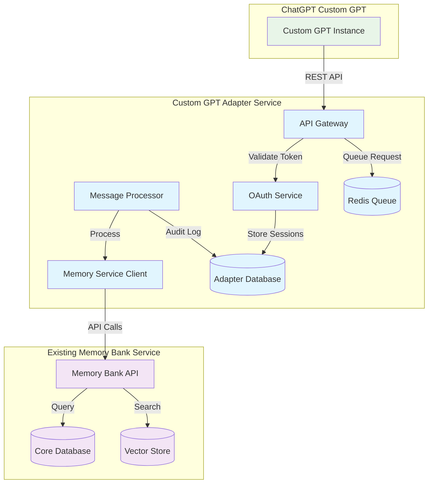

> **Deprecated:** This document has been consolidated into ../brownfield-architecture.md. Please refer to that file for the latest information.

# Component Architecture

*The new components I'm proposing follow standard microservice patterns completely independent from your existing Memory Bank Service codebase. The integration interfaces use only standard REST API consumption patterns. Does this match your preference for architectural isolation?*

## New Components

## CustomGPT API Gateway

**Responsibility:** Primary API interface for ChatGPT Custom GPT requests
**Integration Points:** Independent FastAPI application, no direct integration with core service

**Key Interfaces:**

- REST API endpoints for Custom GPT operations (/api/v1/search, /api/v1/memories)
- OAuth 2.0 token validation and refresh endpoints
- Health check and metrics endpoints

**Dependencies:**

- **Existing Components:** Memory Bank Service (external API client only)
- **New Components:** OAuth Service, Message Queue Service, Audit Service

**Technology Stack:** FastAPI, Pydantic, OAuth 2.0, SQLAlchemy

## OAuth Authentication Service

**Responsibility:** Secure authentication and authorization for Custom GPT applications
**Integration Points:** Independent OAuth 2.0 server with JWT token management

**Key Interfaces:**

- OAuth 2.0 token generation and validation
- Client credential management
- Token refresh and rotation

**Dependencies:**

- **Existing Components:** None - completely independent
- **New Components:** Database Service, Audit Service

**Technology Stack:** FastAPI, python-jose, cryptography, PostgreSQL

## Memory Service Client

**Responsibility:** Interface with Memory Bank Service APIs
**Integration Points:** Standard REST API client consuming existing Memory Bank Service endpoints

**Key Interfaces:**

- Memory search API client with retry logic and circuit breakers
- Memory creation API client with error handling
- Health check monitoring for Memory Bank Service availability

**Dependencies:**

- **Existing Components:** Memory Bank Service (standard API client)
- **New Components:** Circuit Breaker Service, Audit Service

**Technology Stack:** httpx, tenacity, circuit-breaker, asyncio

## Asynchronous Message Processor

**Responsibility:** Background processing of memory operations
**Integration Points:** Redis-based message queue with Celery workers

**Key Interfaces:**

- Redis message queue consumer
- Memory operation task processors
- Result callback handling

**Dependencies:**

- **Existing Components:** Memory Bank Service (API client)
- **New Components:** Redis Queue, Memory Service Client

**Technology Stack:** Celery, Redis, asyncio, SQLAlchemy

## Component Interaction Diagram

