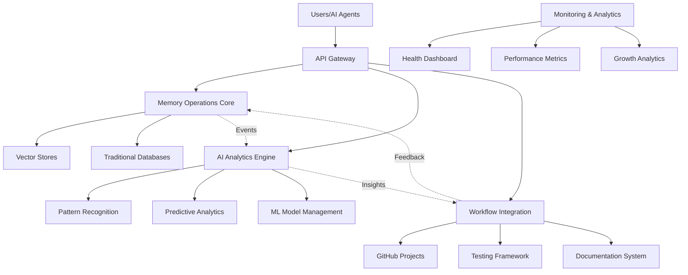
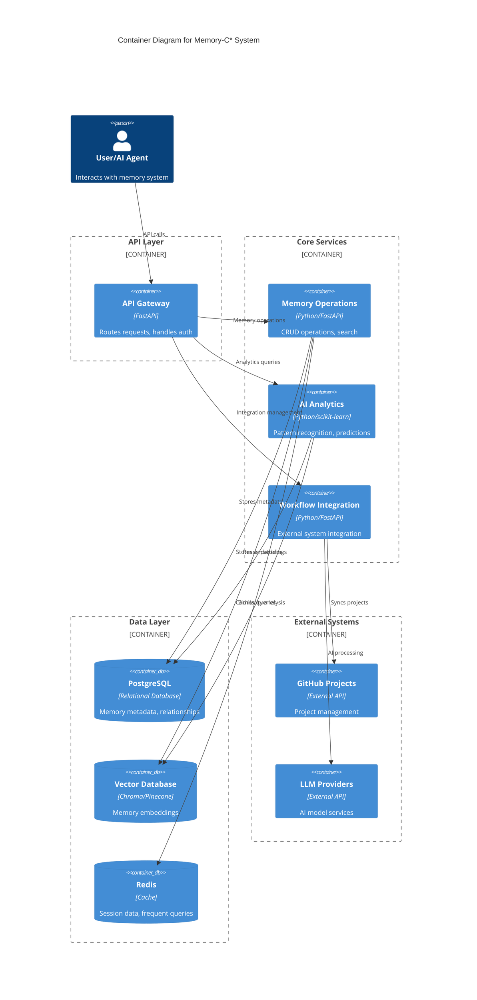
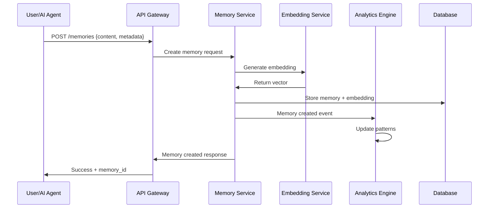
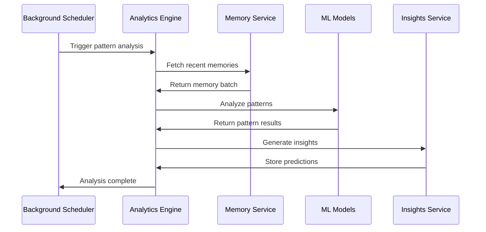

# Memory-C* Architecture Document

## Introduction

This document outlines the overall project architecture for Memory-C*, including backend systems, AI analytics infrastructure, memory operations, and integration components. Its primary goal is to serve as the guiding architectural blueprint for AI-driven development, ensuring consistency and adherence to chosen patterns and technologies for the comprehensive AI memory system.

**Relationship to Frontend Architecture:**
Since Memory-C* is primarily a backend AI system with API endpoints and optional dashboard interfaces, any future frontend components will be minimal and designed primarily for monitoring and analytics visualization.

### Starter Template or Existing Project

**Existing Project Foundation:** Memory-C* is built upon the established mem0 framework foundation with the following existing components:
- mem0 core framework (memory operations, embeddings, LLMs, vector stores)
- openmemory enterprise layer (advanced AI features, analytics, monitoring)
- embedchain legacy integration layer
- Existing test framework and documentation structure

The architecture leverages and extends these existing components while adding new enterprise-grade features, AI analytics, and workflow integrations.

### Change Log

| Date | Version | Description | Author |
| :--- | :------ | :---------- | :----- |
| 2024-12-27 | 1.0 | Initial architecture for Memory-C* comprehensive system | BMAD Master |

## High Level Architecture

### Technical Summary

Memory-C* employs a hybrid monolithic-microservice architecture within a monorepo structure, combining a stable mem0 core with modular openmemory components. The system integrates advanced AI analytics, predictive modeling, and workflow automation while maintaining enterprise-grade reliability and performance. Core architectural patterns include event-driven processing for real-time updates, repository pattern for data abstraction, and plugin architecture for extensible AI model integration.

### High Level Overview

The system follows a **Hybrid Architecture** approach:
1. **Monolithic Core**: mem0 framework provides stable, high-performance memory operations
2. **Microservice Modules**: openmemory components handle specialized AI analytics, monitoring, and integrations
3. **Monorepo Structure**: Unified development and deployment while maintaining component isolation
4. **Event-Driven Communication**: Real-time updates between components and external systems
5. **API-First Design**: RESTful and GraphQL APIs enable integration with external workflows

Primary data flow: User interactions → Memory Operations → AI Analytics → Predictive Insights → Workflow Integration

### High Level Project Diagram



### Architectural and Design Patterns

- **Event-Driven Architecture:** Asynchronous communication between components for real-time updates - _Rationale:_ Enables responsive system behavior and decoupled component interaction
- **Repository Pattern:** Abstract data access across multiple storage backends - _Rationale:_ Supports multiple vector databases and enables seamless backend switching
- **Plugin Architecture:** Extensible AI model and LLM integration - _Rationale:_ Allows integration with multiple AI providers without core system changes
- **CQRS Pattern:** Separate read/write operations for complex analytics queries - _Rationale:_ Optimizes performance for both real-time operations and analytical workloads
- **Circuit Breaker Pattern:** Resilient external service integration - _Rationale:_ Ensures system stability when external services (GitHub, LLMs) are unavailable

## Tech Stack

### Cloud Infrastructure

- **Provider:** Multi-cloud with local development support
- **Key Services:** Docker containers, optional Kubernetes orchestration
- **Deployment Regions:** Configurable based on deployment needs

### Technology Stack Table

| Category           | Technology         | Version     | Purpose                           | Rationale                                    |
| :----------------- | :----------------- | :---------- | :------------------------------- | :------------------------------------------- |
| **Language**       | Python             | 3.8+        | Primary development language      | Existing codebase, rich AI/ML ecosystem     |
| **Runtime**        | CPython            | 3.8+        | Python interpreter                | Standard runtime with excellent performance  |
| **Framework**      | FastAPI            | 0.104.0     | API framework                     | High performance, auto-documentation        |
| **Database**       | PostgreSQL         | 15.0        | Primary relational storage        | ACID compliance, JSON support               |
| **Vector DB**      | Configurable       | Latest      | Vector storage (Chroma/Pinecone)  | Flexible backend support                     |
| **Cache**          | Redis              | 7.0         | In-memory caching                 | Fast access patterns, session storage       |
| **Message Queue**  | Redis/RabbitMQ     | 7.0/3.12    | Async processing                  | Event-driven architecture support           |
| **API Style**      | REST + GraphQL     | -           | API interfaces                    | REST for operations, GraphQL for analytics  |
| **Authentication** | JWT + API Keys     | -           | Security                          | Stateless auth, API key for services        |
| **Testing**        | pytest + hypothesis| 7.4.0       | Test framework                    | AI-driven test generation support           |
| **Build Tool**     | setuptools/pip     | Latest      | Package management                | Python standard tooling                     |
| **IaC Tool**       | Docker Compose     | 2.20        | Infrastructure                    | Simple deployment, development consistency   |
| **Monitoring**     | Prometheus         | 2.45        | Metrics collection                | Industry standard, extensive integrations   |
| **Logging**        | Python logging     | Built-in    | Application logging               | Structured logging with JSON output         |

## Data Models

### Memory

**Purpose:** Core memory entity storing contextual information with metadata and relationships

**Key Attributes:**

- memory_id: UUID - Unique identifier for each memory
- content: Text - The actual memory content (text, code, structured data)
- category: Enum - Auto-categorized type (TECHNICAL, WORKFLOW, PREFERENCE, PROJECT)
- embedding: Vector - High-dimensional vector representation for semantic search
- metadata: JSON - Flexible metadata including source, context, tags
- created_at: Timestamp - Memory creation time
- updated_at: Timestamp - Last modification time
- confidence_score: Float - AI-assigned confidence in memory accuracy
- access_count: Integer - Usage tracking for memory optimization

**Relationships:**

- One-to-many with MemoryRelationships (memory connections)
- Many-to-one with User (memory ownership)
- One-to-many with AnalyticsEvents (usage tracking)

### MemoryRelationship

**Purpose:** Captures semantic and contextual relationships between memories

**Key Attributes:**

- relationship_id: UUID - Unique relationship identifier
- source_memory_id: UUID - Source memory reference
- target_memory_id: UUID - Target memory reference
- relationship_type: Enum - Type of connection (SIMILAR, CONTRADICTS, BUILDS_ON, REFERENCES)
- strength: Float - AI-calculated relationship strength (0.0-1.0)
- context: Text - Description of the relationship

**Relationships:**

- Many-to-one with Memory (both source and target)
- One-to-many with AnalyticsEvents (relationship usage tracking)

### AnalyticsEvent

**Purpose:** Tracks all system interactions for pattern recognition and optimization

**Key Attributes:**

- event_id: UUID - Unique event identifier
- event_type: Enum - Type of event (MEMORY_CREATED, SEARCH_PERFORMED, PATTERN_DETECTED)
- user_id: UUID - User associated with event
- memory_id: UUID - Memory involved (if applicable)
- event_data: JSON - Flexible event-specific data
- timestamp: Timestamp - When event occurred
- session_id: UUID - Session grouping for workflow analysis

**Relationships:**

- Many-to-one with User (event attribution)
- Many-to-one with Memory (memory-related events)
- One-to-many with PredictiveInsights (events generate insights)

### PredictiveInsight

**Purpose:** AI-generated insights and predictions based on memory patterns

**Key Attributes:**

- insight_id: UUID - Unique insight identifier
- insight_type: Enum - Type of prediction (PATTERN, RECOMMENDATION, RISK_ASSESSMENT)
- content: Text - Human-readable insight description
- confidence: Float - AI confidence in the insight (0.0-1.0)
- supporting_memories: Array[UUID] - Memories that support this insight
- created_at: Timestamp - When insight was generated
- expires_at: Timestamp - When insight becomes stale
- action_taken: Boolean - Whether user acted on the insight

**Relationships:**

- Many-to-many with Memory (supporting evidence)
- Many-to-one with User (insight recipient)
- One-to-many with AnalyticsEvents (insight generation events)

## Components

### Memory Operations Core

**Responsibility:** Handles all CRUD operations for memories with high performance and reliability

**Key Interfaces:**

- `/api/v1/memories` - REST API for memory operations
- `MemoryRepository` - Data access abstraction layer
- `EmbeddingService` - Vector generation and similarity search
- `CategoryService` - Automatic memory categorization

**Dependencies:** Vector databases, traditional databases, embedding models

**Technology Stack:** FastAPI, SQLAlchemy, vector database clients (Chroma/Pinecone)

### AI Analytics Engine

**Responsibility:** Processes memory data to generate insights, patterns, and predictive recommendations

**Key Interfaces:**

- `/api/v1/analytics` - Analytics API endpoints
- `PatternRecognitionService` - Identifies memory patterns and relationships
- `PredictiveAnalyticsService` - Generates insights and recommendations
- `MLModelManager` - Manages AI model lifecycle and performance

**Dependencies:** Memory Operations Core, ML frameworks, model storage

**Technology Stack:** scikit-learn, pandas, joblib, FastAPI

### Workflow Integration Hub

**Responsibility:** Integrates memory system with external development workflows and tools

**Key Interfaces:**

- `/api/v1/integrations` - Integration management API
- `GitHubProjectsConnector` - GitHub Projects API integration
- `TestingFrameworkConnector` - AI testing framework integration
- `DocumentationConnector` - Living documentation system integration

**Dependencies:** External APIs (GitHub, testing tools), Memory Operations Core

**Technology Stack:** httpx, GraphQL client, webhook handlers, FastAPI

### Monitoring & Analytics Dashboard

**Responsibility:** Provides system health monitoring, performance metrics, and growth analytics

**Key Interfaces:**

- `/api/v1/monitoring` - Monitoring API endpoints
- `HealthCheckService` - System health validation
- `MetricsCollectionService` - Performance data collection
- `GrowthAnalyticsService` - Usage pattern analysis

**Dependencies:** All other components, monitoring infrastructure

**Technology Stack:** Prometheus client, custom metrics, FastAPI

### Component Diagrams



## External APIs

### GitHub Projects API

- **Purpose:** Synchronize development workflow with memory context and project management
- **Documentation:** https://docs.github.com/en/graphql
- **Base URL(s):** `https://api.github.com/graphql`
- **Authentication:** Bearer token with repo and project permissions
- **Rate Limits:** 5000 requests per hour for GraphQL

**Key Endpoints Used:**

- `POST /graphql` - All GraphQL operations for projects, issues, PRs
- `POST /repos/{owner}/{repo}/hooks` - Webhook management for real-time sync

**Integration Notes:** Uses GraphQL for efficient data fetching, webhooks for real-time updates

### OpenAI API

- **Purpose:** LLM integration for embedding generation and AI analysis
- **Documentation:** https://platform.openai.com/docs/api-reference
- **Base URL(s):** `https://api.openai.com/v1`
- **Authentication:** Bearer token with API key
- **Rate Limits:** Varies by model and tier

**Key Endpoints Used:**

- `POST /embeddings` - Generate vector embeddings for memory content
- `POST /chat/completions` - AI analysis and categorization

**Integration Notes:** Fallback to alternative providers (Anthropic, local models) for resilience

## Core Workflows

### Memory Creation and Processing Workflow



### AI Pattern Recognition Workflow



## REST API Spec

```yaml
openapi: 3.0.0
info:
  title: Memory-C* API
  version: 1.0.0
  description: Comprehensive AI Memory System API
servers:
  - url: http://localhost:8000/api/v1
    description: Development server
  - url: https://memory-c.example.com/api/v1
    description: Production server

paths:
  /memories:
    get:
      summary: Search and retrieve memories
      parameters:
        - name: query
          in: query
          schema:
            type: string
          description: Search query (semantic or exact)
        - name: category
          in: query
          schema:
            type: string
            enum: [TECHNICAL, WORKFLOW, PREFERENCE, PROJECT]
        - name: limit
          in: query
          schema:
            type: integer
            default: 10
      responses:
        '200':
          description: List of matching memories
          content:
            application/json:
              schema:
                type: object
                properties:
                  memories:
                    type: array
                    items:
                      $ref: '#/components/schemas/Memory'
    post:
      summary: Create new memory
      requestBody:
        required: true
        content:
          application/json:
            schema:
              type: object
              properties:
                content:
                  type: string
                metadata:
                  type: object
                category:
                  type: string
                  enum: [TECHNICAL, WORKFLOW, PREFERENCE, PROJECT]
      responses:
        '201':
          description: Memory created successfully
          content:
            application/json:
              schema:
                $ref: '#/components/schemas/Memory'

  /analytics/insights:
    get:
      summary: Get AI-generated insights
      parameters:
        - name: type
          in: query
          schema:
            type: string
            enum: [PATTERN, RECOMMENDATION, RISK_ASSESSMENT]
        - name: confidence_threshold
          in: query
          schema:
            type: number
            minimum: 0.0
            maximum: 1.0
            default: 0.7
      responses:
        '200':
          description: List of insights
          content:
            application/json:
              schema:
                type: object
                properties:
                  insights:
                    type: array
                    items:
                      $ref: '#/components/schemas/Insight'

components:
  schemas:
    Memory:
      type: object
      properties:
        memory_id:
          type: string
          format: uuid
        content:
          type: string
        category:
          type: string
          enum: [TECHNICAL, WORKFLOW, PREFERENCE, PROJECT]
        confidence_score:
          type: number
          minimum: 0.0
          maximum: 1.0
        metadata:
          type: object
        created_at:
          type: string
          format: date-time
        updated_at:
          type: string
          format: date-time
    
    Insight:
      type: object
      properties:
        insight_id:
          type: string
          format: uuid
        insight_type:
          type: string
          enum: [PATTERN, RECOMMENDATION, RISK_ASSESSMENT]
        content:
          type: string
        confidence:
          type: number
          minimum: 0.0
          maximum: 1.0
        created_at:
          type: string
          format: date-time

  securitySchemes:
    BearerAuth:
      type: http
      scheme: bearer
      bearerFormat: JWT
    ApiKeyAuth:
      type: apiKey
      in: header
      name: X-API-Key

security:
  - BearerAuth: []
  - ApiKeyAuth: []
```

## Database Schema

### PostgreSQL Schema

```sql
-- Core memory table
CREATE TABLE memories (
    memory_id UUID PRIMARY KEY DEFAULT gen_random_uuid(),
    content TEXT NOT NULL,
    category VARCHAR(20) NOT NULL CHECK (category IN ('TECHNICAL', 'WORKFLOW', 'PREFERENCE', 'PROJECT')),
    metadata JSONB DEFAULT '{}',
    created_at TIMESTAMP WITH TIME ZONE DEFAULT NOW(),
    updated_at TIMESTAMP WITH TIME ZONE DEFAULT NOW(),
    confidence_score FLOAT DEFAULT 0.0 CHECK (confidence_score >= 0.0 AND confidence_score <= 1.0),
    access_count INTEGER DEFAULT 0,
    user_id UUID REFERENCES users(user_id),
    is_deleted BOOLEAN DEFAULT FALSE
);

-- Memory relationships table
CREATE TABLE memory_relationships (
    relationship_id UUID PRIMARY KEY DEFAULT gen_random_uuid(),
    source_memory_id UUID NOT NULL REFERENCES memories(memory_id),
    target_memory_id UUID NOT NULL REFERENCES memories(memory_id),
    relationship_type VARCHAR(20) NOT NULL CHECK (relationship_type IN ('SIMILAR', 'CONTRADICTS', 'BUILDS_ON', 'REFERENCES')),
    strength FLOAT NOT NULL CHECK (strength >= 0.0 AND strength <= 1.0),
    context TEXT,
    created_at TIMESTAMP WITH TIME ZONE DEFAULT NOW(),
    UNIQUE(source_memory_id, target_memory_id, relationship_type)
);

-- Analytics events table
CREATE TABLE analytics_events (
    event_id UUID PRIMARY KEY DEFAULT gen_random_uuid(),
    event_type VARCHAR(50) NOT NULL,
    user_id UUID REFERENCES users(user_id),
    memory_id UUID REFERENCES memories(memory_id),
    event_data JSONB DEFAULT '{}',
    timestamp TIMESTAMP WITH TIME ZONE DEFAULT NOW(),
    session_id UUID
);

-- Predictive insights table
CREATE TABLE predictive_insights (
    insight_id UUID PRIMARY KEY DEFAULT gen_random_uuid(),
    insight_type VARCHAR(30) NOT NULL CHECK (insight_type IN ('PATTERN', 'RECOMMENDATION', 'RISK_ASSESSMENT')),
    content TEXT NOT NULL,
    confidence FLOAT NOT NULL CHECK (confidence >= 0.0 AND confidence <= 1.0),
    supporting_memories UUID[] DEFAULT '{}',
    created_at TIMESTAMP WITH TIME ZONE DEFAULT NOW(),
    expires_at TIMESTAMP WITH TIME ZONE,
    action_taken BOOLEAN DEFAULT FALSE,
    user_id UUID REFERENCES users(user_id)
);

-- Users table
CREATE TABLE users (
    user_id UUID PRIMARY KEY DEFAULT gen_random_uuid(),
    username VARCHAR(100) UNIQUE NOT NULL,
    email VARCHAR(255) UNIQUE NOT NULL,
    created_at TIMESTAMP WITH TIME ZONE DEFAULT NOW(),
    last_active TIMESTAMP WITH TIME ZONE DEFAULT NOW(),
    preferences JSONB DEFAULT '{}'
);

-- Indexes for performance
CREATE INDEX idx_memories_category ON memories(category);
CREATE INDEX idx_memories_created_at ON memories(created_at DESC);
CREATE INDEX idx_memories_user_id ON memories(user_id);
CREATE INDEX idx_memories_metadata_gin ON memories USING GIN(metadata);
CREATE INDEX idx_analytics_events_timestamp ON analytics_events(timestamp DESC);
CREATE INDEX idx_analytics_events_type ON analytics_events(event_type);
CREATE INDEX idx_memory_relationships_source ON memory_relationships(source_memory_id);
CREATE INDEX idx_memory_relationships_target ON memory_relationships(target_memory_id);
CREATE INDEX idx_predictive_insights_type ON predictive_insights(insight_type);
CREATE INDEX idx_predictive_insights_expires ON predictive_insights(expires_at);
```

### Vector Database Schema (Chroma)

```python
# Chroma collection configuration
MEMORY_COLLECTION_CONFIG = {
    "name": "memory_embeddings",
    "metadata": {
        "hnsw:space": "cosine",
        "hnsw:M": 16,
        "hnsw:ef_construction": 200,
        "hnsw:ef": 100
    },
    "embedding_function": "text-embedding-ada-002"  # OpenAI embeddings
}

# Document structure in vector database
{
    "ids": ["memory_id_1", "memory_id_2"],
    "embeddings": [[0.1, 0.2, ...], [0.3, 0.4, ...]],
    "documents": ["memory content 1", "memory content 2"],
    "metadatas": [
        {
            "category": "TECHNICAL",
            "created_at": "2024-12-27T10:00:00Z",
            "user_id": "user_uuid",
            "confidence_score": 0.95
        },
        {
            "category": "WORKFLOW", 
            "created_at": "2024-12-27T11:00:00Z",
            "user_id": "user_uuid",
            "confidence_score": 0.87
        }
    ]
}
```

## Source Tree

```plaintext
memory-c*/
├── .github/                    # CI/CD workflows
│   └── workflows/
│       ├── ci.yml             # Continuous integration
│       ├── security.yml       # Security scanning
│       └── deploy.yml         # Deployment pipeline
├── .bmad-core/                # BMAD framework files
├── docs/                      # Project documentation
│   ├── prd.md                 # Product Requirements Document
│   ├── architecture.md        # This architecture document
│   ├── api-reference/         # API documentation
│   └── deployment/            # Deployment guides
├── mem0/                      # Core mem0 framework
│   ├── __init__.py
│   ├── memory/                # Memory operations (11 modules)
│   ├── embeddings/            # Embedding providers (14 modules)
│   ├── llms/                  # LLM integrations (20 modules)
│   ├── vector_stores/         # Vector database backends (20 modules)
│   ├── utils/                 # Utility functions
│   └── configs/               # Configuration schemas
├── openmemory/                # Enterprise AI memory layer
│   ├── __init__.py
│   ├── api/                   # API endpoints and routers
│   │   ├── v1/
│   │   │   ├── memories.py    # Memory CRUD operations
│   │   │   ├── analytics.py   # Analytics and insights
│   │   │   ├── integrations.py # External integrations
│   │   │   └── monitoring.py  # Health and metrics
│   │   └── middleware/        # Authentication, CORS, etc.
│   ├── services/              # Business logic services
│   │   ├── memory_service.py  # Memory operations
│   │   ├── analytics_service.py # AI analytics
│   │   ├── integration_service.py # External integrations
│   │   └── monitoring_service.py # System monitoring
│   ├── models/                # Data models and schemas
│   │   ├── memory.py          # Memory models
│   │   ├── analytics.py       # Analytics models
│   │   └── base.py            # Base model classes
│   ├── repositories/          # Data access layer
│   │   ├── memory_repository.py
│   │   ├── analytics_repository.py
│   │   └── base_repository.py
│   ├── ai/                    # AI/ML components
│   │   ├── pattern_recognition.py
│   │   ├── predictive_analytics.py
│   │   ├── categorization.py
│   │   └── model_management.py
│   ├── integrations/          # External service integrations
│   │   ├── github_projects.py
│   │   ├── llm_providers.py
│   │   └── webhook_handlers.py
│   ├── monitoring/            # Monitoring and health checks
│   │   ├── health_checks.py
│   │   ├── metrics.py
│   │   └── analytics.py
│   └── utils/                 # Utility functions
├── tests/                     # Test suite
│   ├── unit/                  # Unit tests
│   │   ├── test_memory_service.py
│   │   ├── test_analytics.py
│   │   └── test_integrations.py
│   ├── integration/           # Integration tests
│   │   ├── test_api_endpoints.py
│   │   ├── test_database.py
│   │   └── test_external_apis.py
│   ├── ai_testing/            # AI-powered testing framework
│   │   ├── adaptive_tests.py
│   │   ├── test_generation.py
│   │   └── self_correction.py
│   ├── fixtures/              # Test data and fixtures
│   └── conftest.py            # Pytest configuration
├── scripts/                   # Utility scripts
│   ├── setup-dev.sh           # Development environment setup
│   ├── migrate-db.py          # Database migration
│   ├── backup-memories.py     # Backup utilities
│   └── performance-test.py    # Performance testing
├── infra/                     # Infrastructure as Code
│   ├── docker/
│   │   ├── Dockerfile         # Application container
│   │   ├── docker-compose.yml # Development stack
│   │   └── docker-compose.prod.yml # Production stack
│   ├── k8s/                   # Kubernetes manifests (optional)
│   └── monitoring/            # Monitoring infrastructure
├── config/                    # Configuration files
│   ├── development.yaml       # Development configuration
│   ├── production.yaml        # Production configuration
│   └── logging.yaml           # Logging configuration
├── .env.example               # Environment variables template
├── .gitignore                 # Git ignore rules
├── requirements.txt           # Python dependencies
├── requirements-dev.txt       # Development dependencies
├── pyproject.toml             # Python project configuration
├── pytest.ini                # Test configuration
├── Makefile                   # Development commands
└── README.md                  # Project overview and setup
```

## Infrastructure and Deployment

### Infrastructure as Code

- **Tool:** Docker Compose 2.20
- **Location:** `infra/docker/`
- **Approach:** Container-based deployment with optional Kubernetes scaling

### Deployment Strategy

- **Strategy:** Blue-Green deployment with rolling updates
- **CI/CD Platform:** GitHub Actions
- **Pipeline Configuration:** `.github/workflows/`

### Environments

- **Development:** Local Docker Compose with SQLite/Chroma
- **Staging:** Docker Compose with PostgreSQL/Redis for integration testing  
- **Production:** Kubernetes or Docker Swarm with managed databases

### Environment Promotion Flow

```text
Development (Local) → Staging (Integration) → Production (Live)
         ↓                    ↓                      ↓
    SQLite/Chroma     PostgreSQL/Redis    Managed Cloud DBs
```

### Rollback Strategy

- **Primary Method:** Container image rollback with database migration reversal
- **Trigger Conditions:** Health check failures, error rate spikes, performance degradation
- **Recovery Time Objective:** < 5 minutes for application rollback, < 15 minutes for data recovery

## Error Handling Strategy

### General Approach

- **Error Model:** Structured exceptions with error codes and contextual information
- **Exception Hierarchy:** Base MemoryError class with specific subclasses for different error types
- **Error Propagation:** Fail-fast approach with graceful degradation for non-critical features

### Error Categories

```python
# Base exception class
class MemoryError(Exception):
    def __init__(self, message: str, error_code: str, context: dict = None):
        self.message = message
        self.error_code = error_code
        self.context = context or {}
        super().__init__(self.message)

# Specific error types
class MemoryNotFoundError(MemoryError):
    """Memory resource not found"""
    pass

class EmbeddingGenerationError(MemoryError):
    """Failed to generate embeddings"""
    pass

class ExternalServiceError(MemoryError):
    """External API service failure"""
    pass

class ValidationError(MemoryError):
    """Input validation failure"""
    pass
```

### Logging Configuration

```yaml
# logging.yaml
version: 1
formatters:
  structured:
    format: '{"timestamp": "%(asctime)s", "level": "%(levelname)s", "logger": "%(name)s", "message": "%(message)s", "extra": %(extra)s}'
    class: pythonjsonlogger.jsonlogger.JsonFormatter

handlers:
  console:
    class: logging.StreamHandler
    formatter: structured
    level: INFO
  file:
    class: logging.handlers.RotatingFileHandler
    filename: logs/memory-c.log
    maxBytes: 10485760  # 10MB
    backupCount: 5
    formatter: structured
    level: DEBUG

loggers:
  openmemory:
    level: DEBUG
    handlers: [console, file]
    propagate: false
  mem0:
    level: INFO
    handlers: [console, file]
    propagate: false

root:
  level: WARNING
  handlers: [console]
```

### Circuit Breaker Implementation

```python
class CircuitBreaker:
    def __init__(self, failure_threshold: int = 5, timeout: int = 60):
        self.failure_threshold = failure_threshold
        self.timeout = timeout
        self.failure_count = 0
        self.last_failure_time = None
        self.state = "CLOSED"  # CLOSED, OPEN, HALF_OPEN
    
    def call(self, func, *args, **kwargs):
        if self.state == "OPEN":
            if time.time() - self.last_failure_time > self.timeout:
                self.state = "HALF_OPEN"
            else:
                raise ExternalServiceError("Service unavailable", "CIRCUIT_OPEN")
        
        try:
            result = func(*args, **kwargs)
            if self.state == "HALF_OPEN":
                self.state = "CLOSED"
                self.failure_count = 0
            return result
        except Exception as e:
            self.failure_count += 1
            self.last_failure_time = time.time()
            
            if self.failure_count >= self.failure_threshold:
                self.state = "OPEN"
            
            raise ExternalServiceError(f"Service call failed: {str(e)}", "SERVICE_ERROR")
```

## Security Considerations

### Authentication and Authorization

- **JWT Tokens:** For user authentication with configurable expiration
- **API Keys:** For service-to-service communication
- **Role-Based Access:** User, Admin, Service roles with specific permissions
- **Rate Limiting:** Per-user and per-endpoint rate limits to prevent abuse

### Data Protection

- **Encryption at Rest:** Database encryption for sensitive memory content
- **Encryption in Transit:** TLS 1.3 for all API communications
- **Data Sanitization:** Automatic PII detection and masking in memory content
- **Audit Logging:** All access and modifications logged for compliance

### Input Validation

```python
from pydantic import BaseModel, validator
from typing import Optional

class MemoryCreateRequest(BaseModel):
    content: str
    category: Optional[str] = None
    metadata: Optional[dict] = {}
    
    @validator('content')
    def content_length(cls, v):
        if len(v.strip()) == 0:
            raise ValueError('Content cannot be empty')
        if len(v) > 50000:  # 50KB limit
            raise ValueError('Content too large')
        return v.strip()
    
    @validator('metadata')
    def metadata_size(cls, v):
        if len(str(v)) > 5000:  # 5KB metadata limit
            raise ValueError('Metadata too large')
        return v
```

This architecture document provides a comprehensive blueprint for implementing the Memory-C* AI-powered memory system with enterprise-grade reliability, performance, and security. The design emphasizes modularity, scalability, and maintainability while supporting the advanced AI features outlined in the PRD.
