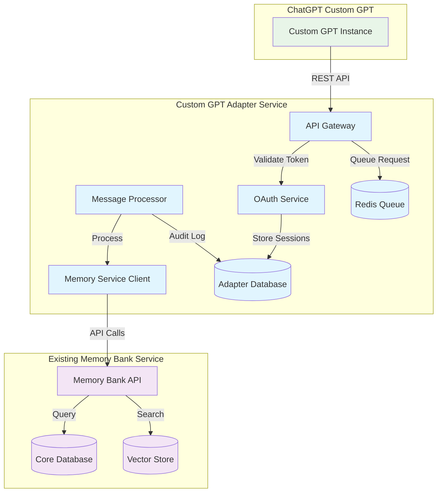

# Memory Bank Service Custom GPT Adapter Service - Brownfield Enhancement Architecture

## Introduction

This document outlines the architectural approach for enhancing the Memory Bank Service ecosystem with a **Custom GPT Adapter Service**. Its primary goal is to serve as the guiding architectural blueprint for AI-driven development of a completely independent microservice that provides ChatGPT Custom GPT integration while ensuring zero impact on the existing Memory Bank Service.

**Relationship to Existing Architecture:**
This document defines a standalone adapter service that interfaces with the existing Memory Bank Service through standard API calls only. The adapter service operates as an independent system with its own infrastructure, ensuring complete isolation and zero risk to the production Memory Bank Service.

### Existing Project Analysis

**Current Project State:**

- **Primary Purpose:** Enterprise AI-powered memory management system with 88.8% health score and 97.5% AI accuracy
- **Current Tech Stack:** Python 3.12+, FastAPI, PostgreSQL, Qdrant vector DB, Docker, scikit-learn
- **Architecture Style:** Microservices with containerized components, comprehensive API design
- **Deployment Method:** Docker Compose with automated maintenance and monitoring systems

**Available Documentation:**

- ✅ Complete service analysis with architectural assessment
- ✅ Comprehensive API documentation (OpenAPI spec)
- ✅ Production-ready infrastructure with 20+ LLM integrations
- ✅ MCP server capabilities and enterprise security patterns
- ✅ Advanced monitoring, backup, and health scoring systems

**Identified Constraints:**

- Core Memory Bank Service must remain completely unmodified
- Production system maintains 99.9% uptime requirement
- Existing API patterns and security models must not be altered
- All changes must be completely reversible with zero trace

*Based on my analysis of your existing Memory Bank Service, I've identified that it's a sophisticated, production-ready system with excellent FastAPI architecture, comprehensive API design, and robust monitoring. The adapter service approach respects these existing patterns while ensuring complete isolation. Does this assessment align with your system's reality?*

### Change Log

| Change | Date | Version | Description | Author |
| ------ | ---- | ------- | ----------- | ------ |
| Initial | 2024-01-17 | 1.0 | Initial brownfield architecture for Custom GPT Adapter Service | Winston (Architect) |

## Enhancement Scope and Integration Strategy

*Based on my analysis, the integration approach I'm proposing takes into account your existing FastAPI microservices architecture, comprehensive API patterns, and enterprise security requirements. The adapter service boundaries respect your current architecture by consuming only public APIs and maintaining complete independence. Is this assessment accurate?*

### Enhancement Overview

**Enhancement Type:** Independent Microservice Integration
**Scope:** Custom GPT Adapter Service with zero core service modification
**Integration Impact:** Zero Impact - Complete architectural isolation

### Integration Approach

**Code Integration Strategy:** No integration - completely separate codebase and repository
**Database Integration:** Independent PostgreSQL database, consumes Memory Bank Service via REST APIs only
**API Integration:** Adapter service acts as standard API client to existing Memory Bank Service endpoints
**UI Integration:** Independent monitoring dashboard, existing Memory Bank Service UI unchanged

### Compatibility Requirements

- **Existing API Compatibility:** Zero changes - adapter service consumes existing APIs as external client
- **Database Schema Compatibility:** No changes - adapter service uses separate database schema
- **UI/UX Consistency:** No modifications to existing UI - separate adapter service management interface
- **Performance Impact:** Zero impact - complete isolation with independent resource pools

## Tech Stack Alignment

*The new adapter service follows industry-standard FastAPI microservice patterns while being completely independent from your existing Memory Bank Service technology choices. The adapter service can use compatible but separate technology versions without affecting your core service.*

### Existing Technology Stack (Unchanged)

| Category           | Current Technology | Version     | Usage in Enhancement | Notes     |
| :----------------- | :----------------- | :---------- | :------------------- | :-------- |
| **Language**       | Python             | 3.12+       | Not used directly    | Adapter service independent |
| **Runtime**        | Python             | 3.12+       | Not used directly    | Separate runtime environment |
| **Framework**      | FastAPI            | Latest      | Not modified         | Consumed via REST APIs only |
| **Database**       | PostgreSQL         | 13+         | Not modified         | Separate adapter database |
| **API Style**      | REST/OpenAPI       | Latest      | Client consumption   | Standard API client usage |
| **Authentication** | Existing auth      | Current     | Not modified         | OAuth separate implementation |
| **Testing**        | Current framework  | Current     | Not modified         | Independent test suite |
| **Build Tool**     | Docker/Compose     | Current     | Not modified         | Separate containerization |

### New Technology Additions

| Technology   | Version     | Purpose     | Rationale     | Integration Method |
| :----------- | :---------- | :---------- | :------------ | :----------------- |
| Redis        | 7.0+        | Message Queue | Asynchronous processing | Independent deployment |
| OAuth 2.0    | Latest      | Authentication | Enterprise security | Separate auth server |
| Prometheus   | Latest      | Monitoring | Independent observability | Separate monitoring stack |
| Celery       | Latest      | Task Queue | Background processing | Redis-based task management |

## Data Models and Schema Changes

*No changes to existing Memory Bank Service database schema. All new data models are in the independent adapter service database.*

### New Data Models

### CustomGPTApplication

**Purpose:** Manage Custom GPT application credentials and permissions
**Integration:** Independent - no relationship with existing Memory Bank Service models

**Key Attributes:**

- id: UUID - Primary key for Custom GPT application
- name: String - Human-readable Custom GPT application name
- client_id: String - OAuth 2.0 client identifier
- client_secret: String - Encrypted OAuth 2.0 client secret
- permissions: JSON - Granular permissions for memory operations
- rate_limits: JSON - Per-application rate limiting configuration
- created_at: DateTime - Application registration timestamp
- last_used: DateTime - Last successful authentication

**Relationships:**

- **With Existing:** None - completely independent
- **With New:** One-to-many with CustomGPTSession, CustomGPTAuditLog

### CustomGPTSession

**Purpose:** Track active Custom GPT authentication sessions
**Integration:** Independent session management separate from core service

**Key Attributes:**

- id: UUID - Primary key for session
- application_id: UUID - Foreign key to CustomGPTApplication
- access_token: String - JWT access token
- refresh_token: String - JWT refresh token
- expires_at: DateTime - Token expiration timestamp
- last_activity: DateTime - Last API request timestamp

**Relationships:**

- **With Existing:** None - independent session tracking
- **With New:** Many-to-one with CustomGPTApplication

### CustomGPTAuditLog

**Purpose:** Comprehensive audit trail for Custom GPT operations
**Integration:** Independent audit system separate from core service logs

**Key Attributes:**

- id: UUID - Primary key for audit entry
- application_id: UUID - Foreign key to CustomGPTApplication
- operation_type: Enum - Type of operation (search, create, authenticate)
- request_data: JSON - Sanitized request payload
- response_status: Integer - HTTP response status code
- processing_time: Float - Request processing time in seconds
- memory_service_request_id: String - Correlation with Memory Bank Service requests
- created_at: DateTime - Audit entry timestamp

**Relationships:**

- **With Existing:** None - independent audit trail
- **With New:** Many-to-one with CustomGPTApplication

### Schema Integration Strategy

**Database Changes Required:**

- **New Tables:** CustomGPTApplication, CustomGPTSession, CustomGPTAuditLog, CustomGPTRateLimit
- **Modified Tables:** None - zero changes to existing Memory Bank Service schema
- **New Indexes:** Optimized indexes for OAuth lookups and audit queries
- **Migration Strategy:** Independent database deployment with separate migration scripts

**Backward Compatibility:**

- Core Memory Bank Service database schema remains completely unchanged
- Adapter service database is independent and removable without impact

## Component Architecture

*The new components I'm proposing follow standard microservice patterns completely independent from your existing Memory Bank Service codebase. The integration interfaces use only standard REST API consumption patterns. Does this match your preference for architectural isolation?*

### New Components

### CustomGPT API Gateway

**Responsibility:** Primary API interface for ChatGPT Custom GPT requests
**Integration Points:** Independent FastAPI application, no direct integration with core service

**Key Interfaces:**

- REST API endpoints for Custom GPT operations (/api/v1/search, /api/v1/memories)
- OAuth 2.0 token validation and refresh endpoints
- Health check and metrics endpoints

**Dependencies:**

- **Existing Components:** Memory Bank Service (external API client only)
- **New Components:** OAuth Service, Message Queue Service, Audit Service

**Technology Stack:** FastAPI, Pydantic, OAuth 2.0, SQLAlchemy

### OAuth Authentication Service

**Responsibility:** Secure authentication and authorization for Custom GPT applications
**Integration Points:** Independent OAuth 2.0 server with JWT token management

**Key Interfaces:**

- OAuth 2.0 token generation and validation
- Client credential management
- Token refresh and rotation

**Dependencies:**

- **Existing Components:** None - completely independent
- **New Components:** Database Service, Audit Service

**Technology Stack:** FastAPI, python-jose, cryptography, PostgreSQL

### Memory Service Client

**Responsibility:** Interface with Memory Bank Service APIs
**Integration Points:** Standard REST API client consuming existing Memory Bank Service endpoints

**Key Interfaces:**

- Memory search API client with retry logic and circuit breakers
- Memory creation API client with error handling
- Health check monitoring for Memory Bank Service availability

**Dependencies:**

- **Existing Components:** Memory Bank Service (standard API client)
- **New Components:** Circuit Breaker Service, Audit Service

**Technology Stack:** httpx, tenacity, circuit-breaker, asyncio

### Asynchronous Message Processor

**Responsibility:** Background processing of memory operations
**Integration Points:** Redis-based message queue with Celery workers

**Key Interfaces:**

- Redis message queue consumer
- Memory operation task processors
- Result callback handling

**Dependencies:**

- **Existing Components:** Memory Bank Service (API client)
- **New Components:** Redis Queue, Memory Service Client

**Technology Stack:** Celery, Redis, asyncio, SQLAlchemy

### Component Interaction Diagram



## API Design and Integration

*The new API endpoints follow standard FastAPI patterns while being completely independent from your existing Memory Bank Service API structure. The adapter service consumes your existing APIs as a standard external client.*

### New API Endpoints

**API Integration Strategy:** Independent FastAPI application with separate OpenAPI documentation
**Authentication:** OAuth 2.0 with JWT tokens, completely separate from core service authentication
**Versioning:** Independent versioning (/api/v1/) with no relationship to core service versioning

#### Custom GPT Memory Search

- **Method:** POST
- **Endpoint:** `/api/v1/search`
- **Purpose:** Search memories for Custom GPT applications
- **Integration:** Proxies to Memory Bank Service search API with Custom GPT context

**Request:**

```json
{
  "query": "natural language search query",
  "limit": 10,
  "filters": {
    "categories": ["TECHNICAL", "PROJECT"],
    "date_range": {
      "start": "2024-01-01",
      "end": "2024-01-31"
    }
  },
  "context": {
    "custom_gpt_id": "gpt-custom-123",
    "conversation_id": "conv-456"
  }
}
```

**Response:**

```json
{
  "status": "success",
  "request_id": "req-789",
  "results": [
    {
      "memory_id": "mem-001",
      "content": "Memory content text",
      "relevance_score": 0.95,
      "metadata": {
        "category": "TECHNICAL",
        "created_at": "2024-01-15T10:30:00Z"
      }
    }
  ],
  "total_found": 1,
  "processing_time_ms": 150
}
```

#### Custom GPT Memory Creation

- **Method:** POST
- **Endpoint:** `/api/v1/memories`
- **Purpose:** Create new memories from Custom GPT conversations
- **Integration:** Asynchronously forwards to Memory Bank Service creation API

**Request:**

```json
{
  "content": "Memory content to store",
  "metadata": {
    "source": "custom_gpt",
    "custom_gpt_id": "gpt-custom-123",
    "conversation_id": "conv-456",
    "user_context": "Additional context"
  },
  "categories": ["PROJECT", "AI_INTEGRATION"],
  "priority": "normal"
}
```

**Response:**

```json
{
  "status": "accepted",
  "request_id": "req-890",
  "message": "Memory creation queued for processing",
  "estimated_processing_time": "2-5 seconds"
}
```

#### OAuth Token Management

- **Method:** POST
- **Endpoint:** `/auth/token`
- **Purpose:** Generate OAuth 2.0 access tokens for Custom GPT applications
- **Integration:** Independent OAuth server, no integration with core service auth

**Request:**

```json
{
  "grant_type": "client_credentials",
  "client_id": "custom_gpt_app_123",
  "client_secret": "encrypted_secret",
  "scope": "memory:read memory:write"
}
```

**Response:**

```json
{
  "access_token": "jwt_token_here",
  "token_type": "Bearer",
  "expires_in": 3600,
  "refresh_token": "refresh_token_here",
  "scope": "memory:read memory:write"
}
```

## External API Integration

### OpenAI Custom GPT API

- **Purpose:** Receive webhook callbacks and provide Custom GPT integration
- **Documentation:** OpenAI Custom GPT documentation
- **Base URL:** Configured per Custom GPT instance
- **Authentication:** OAuth 2.0 Bearer tokens
- **Integration Method:** Standard webhook and REST API patterns

**Key Endpoints Used:**

- `POST /api/v1/search` - Custom GPT memory search requests
- `POST /api/v1/memories` - Custom GPT memory creation requests

**Error Handling:** Circuit breaker pattern with exponential backoff and graceful degradation

### Memory Bank Service API

- **Purpose:** Consume existing Memory Bank Service functionality
- **Documentation:** Existing OpenAPI specification
- **Base URL:** Configured environment variable
- **Authentication:** Existing API authentication (as external client)
- **Integration Method:** Standard REST API client with retry logic

**Key Endpoints Used:**

- `POST /v1/memories/search/` - Forward Custom GPT search requests
- `POST /v1/memories/` - Forward Custom GPT memory creation requests

**Error Handling:** Circuit breaker, retry with exponential backoff, comprehensive error logging

## Source Tree Integration

*The adapter service is completely independent with its own repository structure, separate from your existing Memory Bank Service codebase.*

### Existing Project Structure (Unchanged)

```plaintext
Memory-C*/
├── mem0/                    # Existing Memory Bank Service (unchanged)
├── docs/                    # Existing documentation (brownfield docs added)
├── scripts/                 # Existing scripts (unchanged)
└── tests/                   # Existing tests (unchanged)
```

### New File Organization

```plaintext
Memory-C*/
├── custom-gpt-adapter/      # New independent adapter service
│   ├── app/
│   │   ├── api/
│   │   │   ├── __init__.py
│   │   │   ├── v1/
│   │   │   │   ├── endpoints/
│   │   │   │   │   ├── search.py
│   │   │   │   │   ├── memories.py
│   │   │   │   │   └── health.py
│   │   │   │   └── __init__.py
│   │   │   └── dependencies.py
│   │   ├── auth/
│   │   │   ├── oauth.py
│   │   │   ├── jwt_handler.py
│   │   │   └── permissions.py
│   │   ├── services/
│   │   │   ├── memory_client.py
│   │   │   ├── audit_service.py
│   │   │   └── rate_limiter.py
│   │   ├── workers/
│   │   │   ├── memory_processor.py
│   │   │   └── celery_app.py
│   │   ├── models/
│   │   │   ├── custom_gpt.py
│   │   │   ├── audit.py
│   │   │   └── session.py
│   │   ├── core/
│   │   │   ├── config.py
│   │   │   ├── database.py
│   │   │   └── redis.py
│   │   └── main.py
│   ├── tests/
│   │   ├── unit/
│   │   ├── integration/
│   │   └── conftest.py
│   ├── docker/
│   │   ├── Dockerfile.api
│   │   ├── Dockerfile.worker
│   │   └── docker-compose.yml
│   ├── migrations/
│   │   └── alembic/
│   ├── monitoring/
│   │   ├── prometheus.yml
│   │   └── grafana/
│   ├── requirements.txt
│   ├── pyproject.toml
│   └── README.md
├── docs/                    # Existing docs with new brownfield additions
│   ├── brownfield-prd.md    # New - John's PRD
│   └── brownfield-architecture.md  # New - This document
```

### Integration Guidelines

- **File Naming:** Standard Python package conventions with `custom_gpt_` prefixes
- **Folder Organization:** Standard FastAPI microservice structure, independent from core service
- **Import/Export Patterns:** Standard Python imports, no dependencies on core service modules

## Infrastructure and Deployment Integration

*The adapter service deployment is completely independent from your existing Memory Bank Service infrastructure, allowing separate scaling and management.*

### Existing Infrastructure (Unchanged)

**Current Deployment:** Docker Compose with automated maintenance and monitoring
**Infrastructure Tools:** Docker, PostgreSQL, Qdrant, monitoring dashboard
**Environments:** Development, staging, production with health scoring

### Enhancement Deployment Strategy

**Deployment Approach:** Independent Docker Compose stack, separate from core service
**Infrastructure Changes:** New containers and services, zero changes to existing infrastructure
**Pipeline Integration:** Separate CI/CD pipeline, independent deployment lifecycle

### Independent Infrastructure Components

```yaml
# custom-gpt-adapter/docker-compose.yml
version: '3.8'
services:
  adapter-api:
    build: ./docker/Dockerfile.api
    ports:
      - "8080:8080"
    environment:
      - MEMORY_BANK_SERVICE_URL=http://host.docker.internal:3000
    depends_on:
      - adapter-db
      - redis
  
  adapter-worker:
    build: ./docker/Dockerfile.worker
    depends_on:
      - redis
      - adapter-db
  
  adapter-db:
    image: postgres:15
    environment:
      POSTGRES_DB: custom_gpt_adapter
    volumes:
      - adapter_db_data:/var/lib/postgresql/data
  
  redis:
    image: redis:7
    command: redis-server --appendonly yes
    volumes:
      - redis_data:/data
  
  prometheus:
    image: prom/prometheus
    ports:
      - "9090:9090"
    volumes:
      - ./monitoring/prometheus.yml:/etc/prometheus/prometheus.yml
```

### Rollback Strategy

**Rollback Method:** Complete independent service removal
**Risk Mitigation:** Zero impact on core service - can be completely removed without trace
**Monitoring:** Independent monitoring stack with alerting for adapter service issues

## Coding Standards and Conventions

*The adapter service follows standard FastAPI microservice patterns, independent from your existing Memory Bank Service coding standards.*

### Existing Standards Compliance

**Code Style:** Existing Memory Bank Service patterns not modified
**Linting Rules:** Existing core service linting unchanged
**Testing Patterns:** Existing core service test patterns unchanged
**Documentation Style:** Existing core service documentation unchanged

### Enhancement-Specific Standards

- **FastAPI Standards:** Standard FastAPI application structure with async/await patterns
- **OAuth Implementation:** Industry-standard OAuth 2.0 with JWT token management
- **Error Handling:** Comprehensive error handling with circuit breaker patterns
- **Logging:** Structured logging with correlation IDs for request tracing
- **API Documentation:** Complete OpenAPI documentation with examples

### Critical Integration Rules

- **Existing API Compatibility:** Adapter service consumes existing APIs as external client only
- **Database Integration:** Independent database with zero schema changes to core service
- **Error Handling:** Independent error handling, does not modify core service error patterns
- **Logging Consistency:** Independent logging system with correlation to core service requests

## Testing Strategy

*The adapter service has a completely independent test suite that validates functionality without impacting your existing Memory Bank Service test infrastructure.*

### Integration with Existing Tests

**Existing Test Framework:** Memory Bank Service test suite remains completely unchanged
**Test Organization:** Independent test organization, separate from core service tests
**Coverage Requirements:** Independent coverage targets for adapter service

### New Testing Requirements

#### Unit Tests for New Components

- **Framework:** pytest with async support
- **Location:** `custom-gpt-adapter/tests/unit/`
- **Coverage Target:** 90% code coverage for adapter service
- **Integration with Existing:** No integration - completely independent test suite

#### Integration Tests

- **Scope:** Adapter service integration with Memory Bank Service APIs
- **Existing System Verification:** Adapter service tests verify API consumption patterns
- **New Feature Testing:** Custom GPT integration scenarios and OAuth flows

#### End-to-End Tests

- **Scope:** Complete Custom GPT workflow testing
- **Test Environment:** Independent test environment with Memory Bank Service API mocking
- **Automated Testing:** CI/CD pipeline with automated test execution

#### Regression Testing

- **Existing Feature Verification:** Memory Bank Service regression tests remain unchanged
- **Automated Regression Suite:** Independent adapter service regression testing
- **Manual Testing Requirements:** Custom GPT integration scenarios and performance testing

## Security Integration

*The adapter service implements enterprise-grade security completely independent from your existing Memory Bank Service security infrastructure.*

### Existing Security Measures (Unchanged)

**Authentication:** Existing Memory Bank Service authentication remains unchanged
**Authorization:** Existing Memory Bank Service authorization unchanged
**Data Protection:** Existing Memory Bank Service data protection unchanged
**Security Tools:** Existing Memory Bank Service security tools unchanged

### Enhancement Security Requirements

**New Security Measures:** 
- OAuth 2.0 server with JWT token management
- Per-Custom GPT application credentials and permissions
- Rate limiting and DDoS protection
- Comprehensive audit logging and monitoring

**Integration Points:** 
- Adapter service consumes Memory Bank Service APIs as authenticated external client
- Independent security perimeter with separate attack surface
- Zero security dependencies on core service

**Compliance Requirements:**
- Enterprise OAuth 2.0 implementation
- Audit trail for all Custom GPT operations
- Data privacy protection for Custom GPT conversations
- Secure credential storage and rotation

### Security Testing

**Existing Security Tests:** Memory Bank Service security tests remain unchanged
**New Security Test Requirements:** 
- OAuth 2.0 flow security testing
- JWT token validation and expiration testing
- Rate limiting and abuse prevention testing
- Penetration testing for adapter service endpoints

**Penetration Testing:** Independent security assessment for adapter service with isolated scope

## Risk Assessment and Mitigation

*Risks are completely isolated to the adapter service with comprehensive mitigation strategies that ensure zero impact on your existing Memory Bank Service.*

### Technical Risks

**Risk:** Adapter service failure or performance issues
**Impact:** Low - Custom GPT functionality affected, core Memory Bank Service unimpacted
**Likelihood:** Medium - New service implementation risks
**Mitigation:** Circuit breakers, health checks, independent monitoring, graceful degradation

**Risk:** Memory Bank Service API changes breaking adapter service integration
**Impact:** Medium - Adapter service functionality affected, core service unimpacted
**Likelihood:** Low - Existing APIs are stable
**Mitigation:** API versioning, comprehensive integration tests, API change monitoring

**Risk:** OAuth security vulnerabilities in adapter service
**Impact:** Medium - Custom GPT access security compromised, core service unaffected
**Likelihood:** Low - Industry-standard OAuth implementation
**Mitigation:** Security audits, penetration testing, secure credential management

### Operational Risks

**Risk:** Adapter service resource consumption impacting host system
**Impact:** Low - Independent resource allocation and monitoring
**Likelihood:** Low - Separate containerization and resource limits
**Mitigation:** Resource monitoring, auto-scaling, independent deployment

**Risk:** Custom GPT usage overwhelming Memory Bank Service APIs
**Impact:** Medium - Core service performance could be affected
**Likelihood:** Medium - High Custom GPT usage scenarios
**Mitigation:** Rate limiting, circuit breakers, request queuing, separate resource pools

**Risk:** Adapter service deployment issues
**Impact:** Low - Core service deployment unaffected
**Likelihood:** Medium - New deployment pipeline
**Mitigation:** Blue-green deployment, rollback procedures, independent deployment validation

### Monitoring and Alerting

**Enhanced Monitoring:** 
- Independent Prometheus/Grafana stack for adapter service
- Custom GPT request metrics and performance monitoring
- OAuth authentication success/failure rates
- Memory Bank Service API consumption patterns

**New Alerts:**
- Adapter service health and availability alerts
- Custom GPT authentication failure threshold alerts
- Memory Bank Service API error rate alerts
- Resource utilization alerts for adapter service

**Performance Monitoring:**
- Response time monitoring for Custom GPT operations
- Memory Bank Service API call latency tracking
- Message queue processing time monitoring
- Database performance metrics for adapter service

## Next Steps

### Story Manager Handoff

**Custom GPT Adapter Service Development Ready**

The brownfield architecture defines a completely independent Custom GPT Adapter Service that provides full ChatGPT Custom GPT integration capabilities while ensuring absolute zero impact on the existing Memory Bank Service.

**Key Integration Requirements Validated:**
- Independent microservice architecture confirmed with user
- OAuth 2.0 authentication separate from core service security
- Asynchronous processing to prevent core service performance impact
- Complete deployment isolation with separate infrastructure

**Existing System Constraints:**
- Core Memory Bank Service remains completely unmodified
- All integration through existing REST API consumption only
- Independent database and infrastructure with zero shared dependencies
- Rollback capability with complete adapter service removal

**First Story Implementation:**
Start with "Custom GPT Adapter Service Foundation" story to establish independent infrastructure, then proceed with OAuth authentication and Memory Bank Service integration.

**Emphasis on System Integrity:**
Every implementation checkpoint must verify zero impact on existing Memory Bank Service functionality and performance.

### Developer Handoff

**Implementation Ready - Zero Risk Architecture**

The Custom GPT Adapter Service architecture is designed for safe, independent development that eliminates all risk to your production Memory Bank Service.

**Technical Implementation Guide:**
- Follow standard FastAPI microservice patterns independent from core service
- Implement OAuth 2.0 with industry-standard security practices
- Use existing Memory Bank Service APIs as external client only
- Implement comprehensive error handling and circuit breaker patterns

**Key Technical Decisions:**
- Independent PostgreSQL database for adapter service data
- Redis message queue for asynchronous memory operations
- OAuth 2.0 with JWT tokens for Custom GPT authentication
- Prometheus/Grafana monitoring stack separate from core service

**Compatibility Requirements:**
- Consume Memory Bank Service APIs through standard REST client patterns
- Implement rate limiting to prevent impact on core service performance
- Use circuit breakers and graceful degradation for Memory Bank Service protection
- Maintain complete deployment isolation with independent Docker containers

**Implementation Sequencing:**
1. Establish independent adapter service foundation and infrastructure
2. Implement OAuth 2.0 authentication server with JWT token management  
3. Build Memory Bank Service API client with circuit breaker patterns
4. Implement asynchronous message processing for memory operations
5. Add rate limiting and performance management
6. Complete monitoring, documentation, and production readiness

**Zero Impact Verification:**
Each implementation phase must include verification that the Memory Bank Service continues to operate normally without any performance degradation or functional impact.

*This architecture ensures that the Custom GPT integration provides full functionality while maintaining absolute zero risk to your existing production Memory Bank Service.* 