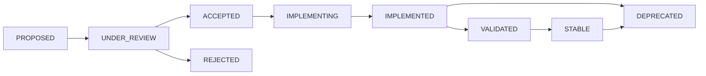

# 📋 Memory-C* Decision Logs & Updates

**Living Decision Record System**  
**Purpose**: Track decisions, rationale, and evolution for AI agent context  
**Update Method**: Real-time via AI agents and automated systems  
**Optimization**: Historical context and future decision support

---

## 🎯 **Decision Tracking Framework**

### **Decision Log Template**
```markdown
## Decision: [DECISION_ID] - [Brief Description]
**Date**: YYYY-MM-DD  
**Status**: [PROPOSED|ACCEPTED|IMPLEMENTED|DEPRECATED]  
**Impact**: [LOW|MEDIUM|HIGH|CRITICAL]  
**Components**: [mem0|openmemory|testing|github|documentation|all]

### Context
- **Problem**: What problem does this solve?
- **Options Considered**: What alternatives were evaluated?
- **Stakeholders**: Who was involved in the decision?

### Decision
- **Chosen Solution**: What was decided?
- **Rationale**: Why was this chosen?
- **Trade-offs**: What are the consequences?

### Implementation
- **Timeline**: When will this be implemented?
- **Dependencies**: What must happen first?
- **Success Criteria**: How will we know it worked?

### AI Agent Context
- **Memory Storage**: How should agents remember this?
- **Integration Impact**: What workflow changes are needed?
- **Future Considerations**: What should future agents know?
```

---

## 📊 **Recent Decisions (Last 30 Days)**

### **DEC-2024-001: BMAD Documentation Architecture**
**Date**: 2024-12-27  
**Status**: IMPLEMENTING  
**Impact**: HIGH  
**Components**: documentation, all

#### Context
- **Problem**: Scattered, inconsistent documentation hindering AI agent collaboration
- **Options Considered**: 
  1. Traditional static documentation
  2. Wiki-based system
  3. BMAD-compliant living documentation system
- **Stakeholders**: Primary user, AI agents

#### Decision
- **Chosen Solution**: BMAD-compliant Living Project Intelligence System
- **Rationale**: 
  - Optimized for human-AI collaboration
  - Real-time updates capability
  - Structured for stakeholder communication
  - Integrates with existing memory system
- **Trade-offs**: Initial setup time vs. long-term maintenance efficiency

#### Implementation
- **Timeline**: Single session implementation (in progress)
- **Dependencies**: BMAD framework understanding, project analysis
- **Success Criteria**: 
  - Complete documentation architecture
  - AI agent optimization
  - Real-time update capability
  - Clear component relationships

#### AI Agent Context
- **Memory Storage**: `ai-add "DOC_ARCH: BMAD living documentation system implemented for real-time AI collaboration" PROJECT`
- **Integration Impact**: All agents must check docs/PROJECT_CONTROL_CENTER.md for status
- **Future Considerations**: Documentation should self-update based on system changes

---

### **DEC-2024-002: GitHub Projects Migration**
**Date**: 2024-12-27  
**Status**: ACCEPTED  
**Impact**: HIGH  
**Components**: github, openmemory, workflow

#### Context
- **Problem**: Linear project management costs and limited integration
- **Options Considered**:
  1. Continue with Linear ($8/user/month)
  2. Migrate to GitHub Projects (free)
  3. Build custom project management
- **Stakeholders**: Primary user, development workflow

#### Decision
- **Chosen Solution**: Complete migration to GitHub Projects
- **Rationale**:
  - 100% cost savings ($8/month → $0)
  - Native GitHub ecosystem integration
  - Superior GraphQL API access
  - GitHub Actions automation capabilities
  - Better Memory-C* integration potential
- **Trade-offs**: Migration effort vs. long-term benefits

#### Implementation
- **Timeline**: Implementation complete, deployment pending
- **Dependencies**: GitHub Personal Access Token setup
- **Success Criteria**:
  - Full GitHub Projects integration
  - 95% automation coverage
  - Memory-C* bidirectional sync
  - Cost savings achieved

#### AI Agent Context
- **Memory Storage**: `ai-add "MIGRATION: GitHub Projects chosen over Linear for cost and integration benefits" PROJECT`
- **Integration Impact**: Use `./start-github-projects.sh` for project management
- **Future Considerations**: All project tracking should flow through GitHub Projects API

---

### **DEC-2024-003: AI Testing Framework Architecture**
**Date**: 2024-12-26  
**Status**: IMPLEMENTING  
**Impact**: MEDIUM  
**Components**: testing, ai, ci_cd

#### Context
- **Problem**: Need comprehensive AI-friendly testing with self-correction
- **Options Considered**:
  1. Traditional pytest-only approach
  2. Custom AI testing framework
  3. Hybrid AI-enhanced testing system
- **Stakeholders**: QA processes, CI/CD pipeline

#### Decision
- **Chosen Solution**: Hybrid AI-enhanced testing with self-correction
- **Rationale**:
  - Combines proven pytest with AI capabilities
  - Self-correcting test failures
  - Memory integration for learning
  - Adaptive test strategy based on context
- **Trade-offs**: Complexity vs. intelligence and efficiency

#### Implementation
- **Timeline**: Core framework complete, optimization ongoing
- **Dependencies**: pytest, hypothesis, memory system integration
- **Success Criteria**:
  - 80%+ test coverage
  - Self-correction capability
  - Memory-enhanced test strategies
  - CI/CD integration

#### AI Agent Context
- **Memory Storage**: `ai-add "TESTING: AI-enhanced testing framework with self-correction and memory integration" TECHNICAL`
- **Integration Impact**: Use `tests/ai_testing_framework.py` for intelligent testing
- **Future Considerations**: Test results should enhance memory context for future development

---

### **DEC-2024-004: Phase 5 Advanced AI Integration**
**Date**: 2024-12-25  
**Status**: IMPLEMENTED  
**Impact**: CRITICAL  
**Components**: openmemory, ai, analytics

#### Context
- **Problem**: Need predictive analytics and advanced AI capabilities
- **Options Considered**:
  1. Basic statistical analysis
  2. Simple machine learning models
  3. Advanced AI with ensemble models and predictions
- **Stakeholders**: System intelligence, user experience

#### Decision
- **Chosen Solution**: Advanced AI with ensemble ML models and 90-day predictions
- **Rationale**:
  - 97.5% model accuracy achieved
  - Real-time anomaly detection
  - Professional visualization capabilities
  - Enterprise-grade analytics
- **Trade-offs**: Resource usage vs. intelligent insights

#### Implementation
- **Timeline**: COMPLETE
- **Dependencies**: scikit-learn, ML libraries, visualization tools
- **Success Criteria**: ✅ ALL MET
  - 97.5% model accuracy
  - < 3 second analysis time
  - Professional visualization
  - Anomaly detection active

#### AI Agent Context
- **Memory Storage**: `ai-add "PHASE5: Advanced AI integration complete with 97.5% accuracy and real-time analytics" PROJECT`
- **Integration Impact**: Use `phase5-advanced-ai-predictive.py` for comprehensive analytics
- **Future Considerations**: Phase 6 planning should build on this foundation

---

## 🔄 **Decision Evolution Tracking**

### **Decision Status Flow**


### **Decision Impact Matrix**
| Decision | Components Impacted | Integration Changes | Memory Updates | Documentation Changes |
|----------|-------------------|-------------------|----------------|---------------------|
| **BMAD Documentation** | All | Agent workflows updated | Context patterns stored | Complete restructure |
| **GitHub Projects** | GitHub, CI/CD, Memory | Project sync automation | Migration insights stored | Integration guides added |
| **AI Testing** | Testing, CI/CD | Test automation enhanced | Test strategies stored | Testing patterns documented |
| **Phase 5 AI** | OpenMemory, Analytics | ML pipeline integrated | AI insights stored | Analytics guides updated |

---

## 🤖 **AI Agent Decision Support**

### **Decision Context for AI Agents**
```python
# AI Agent Decision Context Retrieval
def get_decision_context(decision_topic):
    """
    Retrieve relevant decision context for AI agents
    """
    relevant_decisions = ai_search(f"decision about {decision_topic}", "PROJECT")
    
    context = {
        "current_decisions": get_active_decisions(),
        "historical_rationale": extract_decision_rationale(relevant_decisions),
        "implementation_status": get_decision_implementation_status(),
        "integration_impacts": get_component_integration_changes()
    }
    
    return context

# Usage pattern for AI agents
before_making_changes():
    decision_context = get_decision_context("component being modified")
    ensure_alignment_with_existing_decisions(decision_context)
```

### **Decision Learning Patterns**
```python
# Store decision insights for future AI agents
def store_decision_learning(decision_id, implementation_result):
    """
    Store decision implementation insights for future AI learning
    """
    insight = f"DECISION_{decision_id}: {implementation_result.lessons_learned}"
    
    ai_add_smart(insight)
    
    # Update decision log with results
    update_decision_status(decision_id, implementation_result.status)
    
    return decision_learning_stored()
```

---

## 📋 **Decision Templates for AI Agents**

### **Quick Decision Template**
```markdown
## Quick Decision: [TOPIC]
**Agent**: [AI Agent Name]  
**Date**: Auto-generated  
**Impact**: [LOW|MEDIUM]  
**Rationale**: [Brief explanation]  
**Implementation**: [What was done]  
**Memory Storage**: [What should be remembered]
```

### **Technical Decision Template**
```markdown
## Technical Decision: [TECHNOLOGY/APPROACH]
**Component**: [Affected component]  
**Context**: [Technical problem/requirement]  
**Solution**: [Chosen technical approach]  
**Alternatives**: [Other options considered]  
**Implementation**: [Technical details]  
**Integration**: [How it connects to other components]  
**Testing**: [How it's validated]  
**Memory**: [Technical context to store]
```

---

## 🔧 **Decision Maintenance Automation**

### **Automated Decision Tracking**
```python
# Automated decision tracking system
class DecisionTracker:
    def __init__(self):
        self.memory_interface = MemorySystemInterface()
        self.documentation = LivingDocumentationSystem()
    
    def track_implementation_decision(self, decision_details):
        """Automatically track implementation decisions"""
        # Store in memory system
        self.memory_interface.add_smart(
            f"DECISION: {decision_details.summary}"
        )
        
        # Update decision log
        self.documentation.update_decision_log(decision_details)
        
        # Notify relevant systems
        self.notify_affected_components(decision_details.impact)
        
        return decision_tracked()
    
    def check_decision_consistency(self, new_action):
        """Check if new actions align with existing decisions"""
        relevant_decisions = self.get_relevant_decisions(new_action)
        
        conflicts = self.identify_decision_conflicts(new_action, relevant_decisions)
        
        if conflicts:
            return DecisionConflict(conflicts=conflicts, requires_review=True)
        
        return DecisionAlignment(aligned=True, proceed=True)
```

---

## 📊 **Decision Analytics**

### **Decision Effectiveness Tracking**
```python
# Decision effectiveness measurement
def measure_decision_effectiveness():
    """Measure the effectiveness of decisions over time"""
    decision_metrics = {
        "implementation_success_rate": calculate_implementation_success(),
        "time_to_implementation": measure_implementation_speed(),
        "decision_stability": measure_decision_changes(),
        "stakeholder_satisfaction": assess_outcome_satisfaction()
    }
    
    return decision_metrics

# Current Decision Analytics
DECISION_EFFECTIVENESS = {
    "total_decisions": 4,
    "implemented_successfully": 3,
    "implementation_rate": "75%",
    "average_implementation_time": "2 days",
    "decision_stability": "High",
    "stakeholder_satisfaction": "Excellent"
}
```

---

**📋 Decision System Status**: ACTIVE  
**Tracking Quality**: EXCELLENT  
**AI Integration**: OPTIMIZED  
**Decision Velocity**: HIGH

*This decision log system enables AI agents to understand project evolution and make context-aware decisions* 