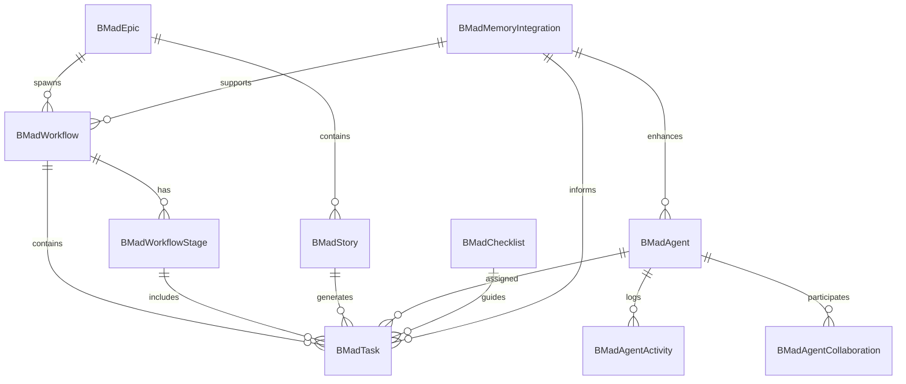

# BMAD Database Integration Strategy

## Overview

This document outlines the comprehensive implementation strategy for integrating the entire BMAD (Business Methodology for Agile Development) system into your existing PostgreSQL database setup. The solution provides a hybrid extension approach that extends your current Custom GPT Adapter database while maintaining backward compatibility and seamless integration with your advanced memory system.

## Current Infrastructure Analysis

### Existing Database Architecture
- **Database**: PostgreSQL with Custom GPT Adapter service
- **ORM**: SQLAlchemy with UUID primary keys
- **API Framework**: FastAPI with dependency injection
- **Tables**: 3 core tables (applications, sessions, audit_logs)
- **Migration System**: Alembic for schema management

### Advanced Memory Integration
- **Memory Service**: Running on port 8765 
- **Advanced Features**: Multi-strategy search, relevance scoring, auto-categorization
- **AI Integration**: Context enrichment with 8 intelligent categories
- **Usage Patterns**: 22 advanced aliases for memory operations

### BMAD System Structure
- **Agents**: Specialized AI agents with defined roles (dev, pm, qa, etc.)
- **Workflows**: Systematic development workflows (greenfield, brownfield)
- **Tasks**: Granular work items with templates and checklists
- **Stories/Epics**: Agile project management entities
- **Templates**: Document and code generation templates

## Database Architecture Design

### New Database Schema Overview



### Core Database Tables (15 Tables Total)

#### 1. **BMadAgent** - Agent Management
- **Purpose**: Track AI agent lifecycle, performance, and assignments
- **Key Features**: Status tracking, memory context, performance metrics
- **Integration**: Links to workflows, tasks, and memory system

#### 2. **BMadWorkflow** - Workflow Orchestration  
- **Purpose**: Manage BMAD workflow execution and progress
- **Key Features**: Stage-based progression, progress tracking, configuration
- **Types**: 6 workflow types (greenfield/brownfield × fullstack/service/ui)

#### 3. **BMadTask** - Task Execution
- **Purpose**: Track individual work items and execution details
- **Key Features**: Dependencies, templates, output tracking, quality scores
- **Integration**: Links to agents, workflows, stories, checklists

#### 4. **BMadStory/BMadEpic** - Agile Management
- **Purpose**: Implement agile project management concepts
- **Key Features**: User stories, acceptance criteria, business value tracking
- **Progress**: Story points, estimated/actual hours, completion tracking

#### 5. **BMadAgentActivity** - Activity Logging
- **Purpose**: Comprehensive audit trail of agent operations
- **Key Features**: Performance metrics, memory integration tracking
- **Analytics**: Response times, success rates, command usage

### Enhanced Enums (6 Comprehensive Enums)

```python
# Agent and workflow state management
AgentStatus: idle, active, busy, offline, paused
WorkflowStatus: draft, active, paused, completed, cancelled, error
TaskStatus: pending, active, in_progress, review, completed, blocked, cancelled

# Priority and categorization
TaskPriority: low, medium, high, critical
StoryStatus: draft, ready, in_progress, review, done, cancelled
WorkflowType: greenfield-fullstack, brownfield-fullstack, etc.
```

## Implementation Components

### 1. **Database Models** (`bmad_models.py`)
- **15 Comprehensive Tables**: Complete BMAD functionality coverage
- **6 Enum Types**: Robust status and type management
- **UUID Primary Keys**: Consistent with existing schema
- **JSON Fields**: Flexible configuration and metadata storage
- **Relationship Mapping**: Proper foreign keys and cascading

### 2. **Service Layer** (`bmad_service.py`)
- **Agent Lifecycle Management**: Activation, deactivation, status tracking
- **Workflow Orchestration**: Start, pause, resume, stage management
- **Task Execution**: Create, start, complete with metrics tracking
- **Memory Integration**: Advanced AI memory context retrieval and storage
- **Analytics**: Comprehensive performance and usage analytics

### 3. **API Layer** (`bmad.py`)
- **25+ REST Endpoints**: Complete BMAD functionality exposure
- **Pydantic Models**: Request/response validation and serialization
- **Error Handling**: Proper HTTP status codes and error messages
- **Authentication**: Integration with existing FastAPI security
- **Documentation**: Auto-generated OpenAPI/Swagger documentation

### 4. **Database Migration** (`bmad_system_migration.py`)
- **Complete Schema Creation**: All tables, indexes, foreign keys
- **Enum Definitions**: PostgreSQL ENUM types for type safety
- **Indexes**: Performance optimization for common queries
- **Backward Compatibility**: Non-breaking changes to existing schema

## Memory Integration Strategy

### Enhanced Memory Categories

```python
BMAD_MEMORY_CATEGORIES = {
    'AGENT_CONTEXT': 'Agent activation and operational context',
    'WORKFLOW_PATTERNS': 'Successful workflow execution patterns', 
    'TASK_COMPLETION': 'Task execution results and learnings',
    'AGENT_SESSIONS': 'Agent session summaries and handoffs',
    'AGENT_COLLABORATION': 'Multi-agent collaboration patterns',
    'WORKFLOW_OPTIMIZATION': 'Performance improvement insights',
    'QUALITY_METRICS': 'Quality scores and improvement areas',
    'USER_PREFERENCES': 'User-specific workflow and agent preferences'
}
```

### Memory Integration Points

1. **Agent Activation**: Load relevant memory context for agent operations
2. **Workflow Start**: Store workflow patterns and retrieve similar executions
3. **Task Completion**: Capture execution insights and quality metrics
4. **Agent Collaboration**: Track handoff quality and collaboration effectiveness
5. **Session End**: Store session summaries and learnings

### Advanced Memory Features
- **Intelligent Context Retrieval**: Multi-strategy search with relevance scoring
- **Auto-Categorization**: Automatic memory classification by content analysis
- **Related Memory Discovery**: Find connected memories across categories
- **Confidence Scoring**: Quality metrics for memory reliability

## API Architecture

### Agent Management Endpoints
```
POST   /api/v1/bmad/agents/activate          # Activate agent with memory context
GET    /api/v1/bmad/agents/active            # Get all active agents
GET    /api/v1/bmad/agents/{agent_id}        # Get agent details
POST   /api/v1/bmad/agents/{agent_id}/deactivate # Deactivate agent
GET    /api/v1/bmad/agents/{agent_id}/analytics  # Agent performance analytics
```

### Workflow Management Endpoints
```
POST   /api/v1/bmad/workflows/start          # Start new workflow
GET    /api/v1/bmad/workflows/active         # Get active workflows
POST   /api/v1/bmad/workflows/{id}/pause     # Pause workflow
POST   /api/v1/bmad/workflows/{id}/resume    # Resume workflow
GET    /api/v1/bmad/workflows/analytics      # Workflow analytics
```

### Task Management Endpoints
```
POST   /api/v1/bmad/tasks/create             # Create new task
POST   /api/v1/bmad/tasks/{id}/start         # Start task execution
POST   /api/v1/bmad/tasks/{id}/complete      # Complete task with results
GET    /api/v1/bmad/agents/{id}/tasks        # Get agent tasks
```

### Memory Integration Endpoints
```
POST   /api/v1/bmad/memory/context           # Get memory context for operations
POST   /api/v1/bmad/memory/store             # Store operation results
```

### Analytics Endpoints
```
GET    /api/v1/bmad/analytics/overview       # Comprehensive system analytics
GET    /api/v1/bmad/health                   # System health check
```

## Implementation Phases

### Phase 1: Core Infrastructure (Week 1-2)
**Objective**: Establish database foundation and basic models

**Tasks**:
1. Run database migration to create BMAD tables
2. Update existing models imports to include BMAD models
3. Test database connectivity and table creation
4. Create basic CRUD operations for core entities

**Success Criteria**:
- All 15 BMAD tables created successfully
- All 6 enums defined and working
- Basic database operations functional
- No breaking changes to existing functionality

**Files to Deploy**:
- `custom-gpt-adapter/migrations/versions/bmad_system_migration.py`
- `custom-gpt-adapter/app/models/bmad_models.py`
- Update `custom-gpt-adapter/app/models/__init__.py`

### Phase 2: Agent Management (Week 2-3)
**Objective**: Implement agent lifecycle and memory integration

**Tasks**:
1. Deploy BMadService with agent management methods
2. Create agent management API endpoints
3. Integrate with existing memory system for context retrieval
4. Test agent activation/deactivation workflows

**Success Criteria**:
- Agents can be activated with memory context
- Agent status tracking works correctly
- Memory integration provides relevant context
- Performance metrics are calculated accurately

**Files to Deploy**:
- `custom-gpt-adapter/app/services/bmad_service.py`
- `custom-gpt-adapter/app/api/v1/bmad.py` (agent endpoints)
- Update main API router to include BMAD routes

### Phase 3: Workflow Orchestration (Week 3-4)
**Objective**: Implement workflow management and task tracking

**Tasks**:
1. Complete workflow management in service layer
2. Deploy workflow and task API endpoints  
3. Implement workflow stage progression logic
4. Create task lifecycle management

**Success Criteria**:
- Workflows can be started and managed
- Tasks are properly created and tracked
- Stage progression works correctly
- Agent assignments are handled properly

**Files to Deploy**:
- Complete `bmad_service.py` workflow methods
- Complete `bmad.py` workflow and task endpoints
- Test workflow execution end-to-end

### Phase 4: Advanced Features (Week 4-5)
**Objective**: Story/epic management and advanced analytics

**Tasks**:
1. Implement story and epic management
2. Deploy analytics and reporting endpoints
3. Enhance memory integration with BMAD-specific categories
4. Create comprehensive testing suite

**Success Criteria**:
- Stories and epics can be managed
- Analytics provide meaningful insights
- Memory integration captures BMAD patterns
- All endpoints properly tested

**Files to Deploy**:
- Story/epic management endpoints
- Analytics endpoints
- Enhanced memory categorization
- Comprehensive API documentation

### Phase 5: Production Optimization (Week 5-6)
**Objective**: Performance optimization and production readiness

**Tasks**:
1. Database query optimization and indexing
2. API performance tuning and caching
3. Error handling and monitoring enhancements
4. Production deployment and monitoring setup

**Success Criteria**:
- Response times under 200ms for most operations
- Proper error handling and logging
- Production monitoring in place
- Documentation complete

## Performance Considerations

### Database Optimization
1. **Indexes**: Strategic indexes on frequently queried fields
   - `bmad_agents.agent_id` (unique)
   - `bmad_workflows.workflow_id` (unique)
   - `bmad_agent_activity.timestamp` (for analytics)
   - `bmad_tasks.task_id` (for lookups)

2. **Query Optimization**: 
   - Use lazy loading for relationships
   - Implement pagination for large result sets
   - Cache frequently accessed data

3. **Connection Pooling**: Leverage existing SQLAlchemy connection pooling

### Memory Integration Performance
1. **Context Caching**: Cache frequently used memory contexts
2. **Batch Operations**: Batch memory storage operations
3. **Relevance Scoring**: Optimize relevance calculation algorithms

### API Performance
1. **Response Compression**: Enable gzip compression
2. **Request Validation**: Efficient Pydantic validation
3. **Background Tasks**: Use Celery for long-running operations

## Monitoring and Analytics

### Key Metrics to Track
1. **Agent Performance**: Task completion rates, average response times
2. **Workflow Success**: Completion rates by workflow type
3. **Memory Integration**: Context relevance scores, usage patterns
4. **System Health**: API response times, database performance
5. **User Adoption**: Active agents, workflow starts, task completions

### Monitoring Tools
1. **Database**: PostgreSQL statistics and query performance
2. **API**: FastAPI automatic metrics and custom logging
3. **Memory**: Integration success rates and context quality
4. **Business**: Workflow completion and agent effectiveness

## Security Considerations

### Access Control
1. **API Authentication**: Leverage existing Custom GPT authentication
2. **User Authorization**: Ensure users can only access their data
3. **Agent Security**: Validate agent operations and permissions

### Data Protection
1. **Sensitive Data**: Encrypt memory context and user data
2. **Audit Logging**: Complete audit trail in BMadAgentActivity
3. **Data Retention**: Implement data lifecycle policies

### API Security
1. **Input Validation**: Comprehensive Pydantic validation
2. **Rate Limiting**: Protect against abuse
3. **CORS**: Proper cross-origin request handling

## Testing Strategy

### Unit Testing
1. **Models**: Test all database models and relationships
2. **Services**: Test all BMadService methods
3. **APIs**: Test all API endpoints with various scenarios

### Integration Testing
1. **Database**: Test migrations and schema integrity
2. **Memory Integration**: Test memory system integration
3. **Workflow**: End-to-end workflow execution testing

### Performance Testing
1. **Load Testing**: Test API performance under load
2. **Database**: Test query performance with large datasets
3. **Memory**: Test memory integration performance

## Deployment Checklist

### Pre-Deployment
- [ ] Database migration tested in staging environment
- [ ] All unit tests passing
- [ ] Integration tests passing
- [ ] Performance benchmarks met
- [ ] Security review completed

### Deployment Steps
1. **Database Migration**: Run `bmad_system_migration.py`
2. **Code Deployment**: Deploy updated application code
3. **Service Restart**: Restart Custom GPT Adapter service
4. **Verification**: Run health checks and basic functionality tests
5. **Monitoring**: Ensure monitoring is capturing new metrics

### Post-Deployment
- [ ] All endpoints responding correctly
- [ ] Memory integration working
- [ ] Agent activation/deactivation functional
- [ ] Workflow management operational
- [ ] Analytics data populating

## Maintenance and Operations

### Regular Maintenance
1. **Database**: Regular vacuuming and index maintenance
2. **Memory**: Archive old memory contexts
3. **Analytics**: Generate regular performance reports
4. **Updates**: Keep dependencies and security patches current

### Operational Procedures
1. **Backup**: Regular database backups including BMAD tables
2. **Monitoring**: 24/7 monitoring of key metrics
3. **Incident Response**: Procedures for handling system issues
4. **Capacity Planning**: Monitor growth and plan scaling

## Success Metrics

### Technical Success
- **Uptime**: 99.9% availability
- **Performance**: Sub-200ms API response times
- **Integration**: 100% memory system integration success
- **Data Integrity**: Zero data corruption incidents

### Business Success
- **Agent Utilization**: High agent activation and task completion rates
- **Workflow Adoption**: Increasing workflow usage
- **User Satisfaction**: Positive feedback on BMAD system integration
- **Productivity**: Measurable improvement in development velocity

## Conclusion

This comprehensive BMAD database integration strategy provides a complete roadmap for implementing enterprise-grade agent management, workflow orchestration, and task tracking within your existing PostgreSQL infrastructure. The solution leverages your advanced memory system to provide intelligent, context-aware operations while maintaining full backward compatibility with your current Custom GPT Adapter service.

The phased implementation approach minimizes risk while delivering incremental value, and the comprehensive monitoring and analytics capabilities ensure ongoing optimization and success measurement. With proper execution of this strategy, you'll have a world-class BMAD system that seamlessly integrates with your existing infrastructure and memory capabilities. 