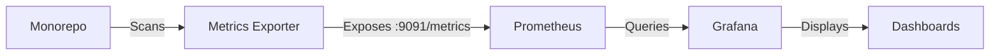

# Dependency Monitoring Setup Guide

## Overview

This guide covers the monitoring infrastructure for tracking dependency management metrics in the MemoryBank monorepo. The setup includes:

- **Prometheus**: Time-series database for metrics collection
- **Grafana**: Visualization and dashboards
- **Dependency Metrics Exporter**: Custom service that scans the monorepo and exports metrics

## Quick Start

### 1. Start the Monitoring Stack

```bash
cd docker
docker-compose -f docker-compose.monitoring.yml up -d
```

This will start:
- Prometheus on http://localhost:9090
- Grafana on http://localhost:3000 (admin/admin)
- Metrics Exporter on http://localhost:9091/metrics

### 2. Access Grafana Dashboards

1. Navigate to http://localhost:3000
2. Login with username: `admin`, password: `admin`
3. Go to Dashboards → Browse
4. Open "Dependency Management Metrics"

## Metrics Explained

### Vulnerability Metrics

- **Critical Vulnerabilities**: Count of critical security issues requiring immediate attention
- **High Vulnerabilities**: Count of high-severity issues that should be addressed soon
- **Vulnerability Trend**: Time-series showing vulnerability counts over time

### Dependency Freshness

- **Dependency Freshness %**: Percentage of dependencies that are up-to-date
- **Outdated Dependencies**: Count of packages with newer versions available
- **Dependencies by Ecosystem**: Breakdown of Python vs JavaScript dependencies

### Build & Update Metrics

- **Build Success Rate**: Percentage of successful builds (CI/CD integration required)
- **Avg Update Duration**: Average time taken to update dependencies
- **Updates This Week**: Count of dependency updates in the last 7 days

## Architecture



## Configuration

### Adding New Projects

To monitor additional projects, update the `DependencyScanner` class in `scripts/dependency-metrics-exporter.py`:

```python
self.python_projects = [
    '.',
    'custom-gpt-adapter',
    'mem0',
    'new-python-project',  # Add here
]

self.js_projects = [
    'mem0/mem0-ts',
    'new-js-project',  # Add here
]
```

### Custom Metrics

To add custom metrics, modify the exporter script:

```python
# Define new metric
custom_metric = Gauge('custom_metric_name', 'Description')

# Update metric value
custom_metric.set(value)
```

### Alert Rules

Create alert rules in Prometheus by adding to `monitoring/prometheus-alerts.yml`:

```yaml
groups:
  - name: dependency_alerts
    rules:
      - alert: CriticalVulnerabilities
        expr: dependency_vulnerabilities_critical_total > 0
        for: 5m
        annotations:
          summary: "Critical vulnerabilities detected"
```

## Troubleshooting

### Metrics Not Updating

1. Check exporter logs: `docker logs memorybank-metrics-exporter`
2. Verify Poetry is installed in the container
3. Ensure all project paths are correct

### Grafana Dashboard Empty

1. Check Prometheus targets: http://localhost:9090/targets
2. Verify the `dependency-metrics` target is UP
3. Check for metrics at http://localhost:9091/metrics

### High Memory Usage

The metrics exporter scans all projects every 5 minutes. To reduce load:
- Increase the scan interval in `dependency-metrics-exporter.py`
- Reduce the number of monitored projects

## Integration with CI/CD

To integrate with your CI/CD pipeline:

1. **GitHub Actions**: Use the dependency quality gates workflow (`.github/workflows/dependency-quality-gates.yml`)
2. **Export Metrics**: Have CI/CD push metrics to Prometheus using pushgateway
3. **Webhook Integration**: Configure Dependabot to send updates to the metrics exporter

## Success Metrics Targets

Based on the dependency analysis report, aim for:

- **0** Critical vulnerabilities
- **< 5** High vulnerabilities
- **> 90%** Dependency freshness
- **> 95%** Build success rate
- **< 30s** Average update duration

## Maintenance

### Weekly Tasks
- Review vulnerability alerts
- Check outdated dependencies count
- Analyze build failure patterns

### Monthly Tasks
- Update monitoring dashboards
- Review and adjust alert thresholds
- Analyze dependency update trends

## References

- [Prometheus Documentation](https://prometheus.io/docs/)
- [Grafana Documentation](https://grafana.com/docs/)
- [Dependency Management Best Practices](../docs/Dependency_Governance_Policy.md) 