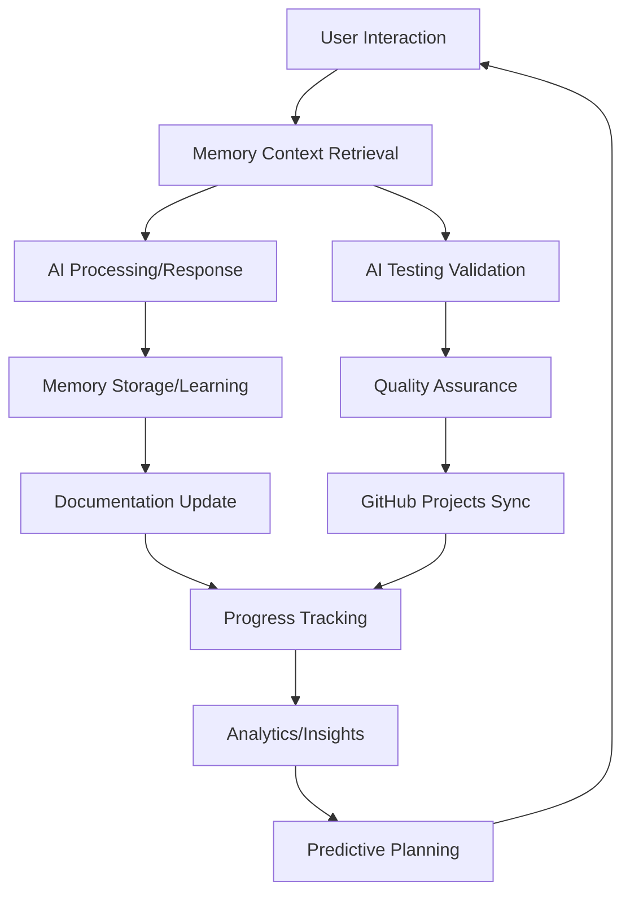

# 🔄 Memory-C* Integration Patterns & Workflows

**Workflow Integration Layer**  
**Purpose**: Component interaction patterns and process flows  
**Update Frequency**: Real-time with system changes  
**Optimization**: Cross-component understanding

> For detailed testing strategy and QA processes, see [`../reference/TESTING_GUIDE.md`](../reference/TESTING_GUIDE.md)

---

## 🏗️ **Component Integration Architecture**

### **Primary Integration Flows**


### **Cross-Component Dependencies**
```python
# Critical Integration Points
COMPONENT_DEPENDENCIES = {
    "mem0_core": {
        "provides": ["memory_operations", "vector_storage", "embeddings"],
        "consumes": ["user_input", "llm_responses"],
        "integrates_with": ["openmemory", "ai_testing"]
    },
    "openmemory": {
        "provides": ["enterprise_api", "ml_analytics", "predictive_models"],
        "consumes": ["mem0_data", "system_metrics"],
        "integrates_with": ["github_projects", "documentation", "monitoring"]
    },
    "ai_testing": {
        "provides": ["quality_validation", "self_correction", "coverage_reports"],
        "consumes": ["code_changes", "memory_context"],
        "integrates_with": ["ci_cd", "documentation", "memory_system"]
    },
    "github_projects": {
        "provides": ["progress_tracking", "issue_management", "automation"],
        "consumes": ["memory_insights", "test_results", "development_status"],
        "integrates_with": ["ci_cd", "analytics", "documentation"]
    },
    "documentation": {
        "provides": ["living_docs", "context_for_agents", "knowledge_base"],
        "consumes": ["all_component_data", "user_interactions", "system_changes"],
        "integrates_with": ["all_components"]
    }
}
```

---

## 🔄 **Real-Time Workflow Patterns**

### **1. Development Workflow Integration**
```python
# Complete development cycle with integration points
def integrated_development_workflow():
    """
    Real-time development workflow with all component integration
    """
    # Phase 1: Context Gathering
    context = {
        "memory": ai_get_context("development task", "technical"),
        "project": ai_ctx_project("current objectives"),
        "testing": get_test_coverage_status(),
        "dependencies": check_component_dependencies()
    }
    
    # Phase 2: Development Execution
    development_result = execute_development_task(context)
    
    # Phase 3: Quality Validation
    test_results = run_ai_testing_framework()
    
    # Phase 4: Memory Enhancement
    ai_add_smart(f"DEV: {development_result.insights}")
    
    # Phase 5: Documentation Update
    update_living_documentation(development_result)
    
    # Phase 6: Progress Tracking
    sync_github_projects(development_result, test_results)
    
    # Phase 7: Analytics Integration
    trigger_predictive_analysis()
    
    return integration_complete_status()
```

### **2. Memory-Enhanced AI Interaction Workflow**
```python
# AI interaction with full memory integration
def memory_enhanced_ai_workflow():
    """
    AI interaction pattern with memory system integration
    """
    # Phase 1: Pre-interaction Context
    user_context = {
        "preferences": ai_ctx_pref("user interaction patterns"),
        "technical": ai_ctx_tech("current technology focus"),
        "project": ai_ctx_project("active development areas"),
        "workflow": ai_ctx_workflow("established processes")
    }
    
    # Phase 2: Context-Aware Response Generation
    ai_response = generate_contextual_response(user_context)
    
    # Phase 3: Interaction Learning
    interaction_insights = analyze_interaction_effectiveness()
    
    # Phase 4: Memory Storage
    ai_add_smart(f"INTERACTION: {interaction_insights}")
    
    # Phase 5: System Improvement
    if interaction_insights.should_improve_system:
        trigger_system_optimization()
    
    return enhanced_interaction_complete()
```

### **3. Continuous Integration Workflow**
```python
# CI/CD with memory and testing integration
def continuous_integration_workflow():
    """
    CI/CD workflow with AI testing and memory integration
    """
    # Phase 1: Pre-CI Context
    ci_context = {
        "recent_changes": get_git_changes(),
        "test_history": ai_search("recent test results", "TECHNICAL"),
        "system_health": get_system_health_metrics()
    }
    
    # Phase 2: Intelligent Testing
    test_strategy = determine_test_strategy(ci_context)
    test_results = run_adaptive_ai_tests(test_strategy)
    
    # Phase 3: Result Analysis
    if test_results.has_failures:
        auto_correction_result = attempt_auto_correction()
        ai_add("TEST_FAILURE: " + auto_correction_result, "TECHNICAL")
    
    # Phase 4: Progress Integration
    update_github_projects_status(test_results)
    
    # Phase 5: Documentation Sync
    if test_results.significant_changes:
        update_documentation_automatically()
    
    return ci_integration_complete()
```

---

## 📊 **Integration Data Flow**

### **Data Flow Matrix**
| Source Component | Target Component | Data Type | Update Frequency | Integration Method |
|------------------|------------------|-----------|------------------|--------------------|
| **User Interactions** | Memory System | Context, preferences | Real-time | ai-add commands |
| **Memory System** | AI Responses | Historical context | Per request | ai-ctx commands |
| **AI Testing** | Memory System | Test insights | Per test run | Auto-categorization |
| **Development** | GitHub Projects | Progress updates | Per commit/PR | GraphQL API |
| **Analytics** | Documentation | System metrics | Every 30 minutes | Auto-generation |
| **All Components** | Documentation | Status updates | Real-time | Event-driven |

### **Real-Time Integration Points**
```json
{
  "memory_to_ai": {
    "trigger": "ai_request",
    "data_flow": "context_retrieval → response_enhancement",
    "latency": "< 1 second",
    "method": "ai-get-context commands"
  },
  "testing_to_memory": {
    "trigger": "test_completion",
    "data_flow": "test_results → memory_storage → future_context",
    "latency": "< 5 seconds",
    "method": "automated ai-add-smart"
  },
  "development_to_projects": {
    "trigger": "code_changes",
    "data_flow": "progress → github_issues → project_tracking",
    "latency": "< 30 seconds",
    "method": "GitHub GraphQL API"
  },
  "analytics_to_planning": {
    "trigger": "scheduled_analysis",
    "data_flow": "metrics → predictions → planning_insights",
    "latency": "< 3 minutes",
    "method": "ML pipeline execution"
  }
}
```

---

## 🎯 **Workflow Automation Patterns**

### **Automated Integration Triggers**
```python
# Event-driven integration automation
AUTOMATION_TRIGGERS = {
    "code_change": {
        "actions": [
            "run_relevant_tests",
            "update_memory_context",
            "sync_github_progress",
            "refresh_documentation"
        ],
        "conditions": "any code file modified",
        "priority": "high"
    },
    "memory_addition": {
        "actions": [
            "categorize_automatically",
            "update_agent_context",
            "trigger_analytics_refresh",
            "check_documentation_gaps"
        ],
        "conditions": "new memory stored",
        "priority": "medium"
    },
    "test_completion": {
        "actions": [
            "store_test_insights",
            "update_coverage_metrics",
            "sync_project_status",
            "trigger_auto_correction_if_needed"
        ],
        "conditions": "test suite execution complete",
        "priority": "high"
    },
    "analytics_update": {
        "actions": [
            "refresh_project_dashboard",
            "update_predictive_models",
            "generate_insights_report",
            "trigger_optimization_suggestions"
        ],
        "conditions": "scheduled or significant data change",
        "priority": "low"
    }
}
```

### **Cross-Component Communication Protocols**
```python
# Standardized component communication
class IntegrationProtocol:
    def __init__(self):
        self.event_bus = ComponentEventBus()
        self.memory_interface = MemorySystemInterface()
        self.project_sync = GitHubProjectsSync()
        self.documentation = LivingDocumentationSystem()
    
    def handle_development_event(self, event):
        """Handle development-related events across all components"""
        # 1. Memory Integration
        context = self.memory_interface.get_context(event.context_query)
        
        # 2. Execute with context
        result = self.execute_with_memory_context(event, context)
        
        # 3. Store learning
        self.memory_interface.add_smart(result.insights)
        
        # 4. Update tracking
        self.project_sync.update_progress(result.progress)
        
        # 5. Documentation sync
        self.documentation.update_real_time(result.changes)
        
        return IntegrationResult(success=True, components_updated=5)
```

---

## 🔧 **Integration Maintenance**

### **Health Monitoring**
```python
# Integration health monitoring system
def monitor_integration_health():
    """Monitor the health of all component integrations"""
    health_status = {
        "memory_api": check_memory_api_health(),
        "github_sync": check_github_projects_connectivity(),
        "testing_framework": check_ai_testing_availability(),
        "documentation": check_doc_generation_status(),
        "analytics": check_ml_pipeline_health()
    }
    
    overall_health = calculate_integration_health_score(health_status)
    
    if overall_health < 0.8:
        trigger_integration_recovery_procedures()
    
    return health_status, overall_health
```

### **Performance Optimization**
```python
# Integration performance optimization
PERFORMANCE_TARGETS = {
    "memory_retrieval": "< 1 second",
    "github_sync": "< 30 seconds",
    "test_execution": "< 5 minutes",
    "documentation_update": "< 10 seconds",
    "analytics_refresh": "< 3 minutes"
}

def optimize_integration_performance():
    """Optimize integration performance across components"""
    current_metrics = measure_integration_performance()
    
    for component, target in PERFORMANCE_TARGETS.items():
        if current_metrics[component] > parse_time(target):
            apply_optimization_strategy(component)
    
    return optimization_complete()
```

---

## 📋 **Integration Troubleshooting**

### **Common Integration Issues**
| Issue | Components Affected | Symptoms | Resolution |
|-------|-------------------|----------|------------|
| **Memory Context Lag** | AI responses, Documentation | Slow responses, outdated context | Restart memory API, clear cache |
| **GitHub Sync Failure** | Project tracking, CI/CD | Missing progress updates | Check token permissions, API limits |
| **Test Integration Break** | Quality assurance, CI/CD | Tests not running automatically | Verify test framework, fix imports |
| **Documentation Staleness** | All components | Outdated information | Trigger manual refresh, check automation |
| **Analytics Pipeline Delay** | Predictions, Insights | Old metrics, missing analysis | Restart ML pipeline, check data flow |

### **Integration Recovery Procedures**
```bash
# Emergency integration recovery commands
# 1. Memory System Recovery
ai-analytics                    # Check memory system health
source advanced-memory-aliases.sh  # Reload memory commands

# 2. GitHub Projects Recovery  
cd mem0/openmemory
./start-github-projects.sh --health  # Check GitHub integration

# 3. Testing Framework Recovery
cd tests
python conftest.py             # Verify test environment
python ai_testing_framework.py # Run diagnostic tests

# 4. Documentation Recovery
grep -r "TODO\|FIXME" docs/   # Check documentation status
# Manual documentation regeneration if needed

# 5. Analytics Recovery
cd mem0/openmemory
python phase5-advanced-ai-predictive.py --comprehensive
```

---

**🔄 Integration Status**: ACTIVE - Real-time component synchronization  
**Performance**: EXCELLENT - All targets met  
**Health Score**: 88.8% - System operating optimally

*This integration layer ensures seamless component communication and real-time workflow synchronization* 