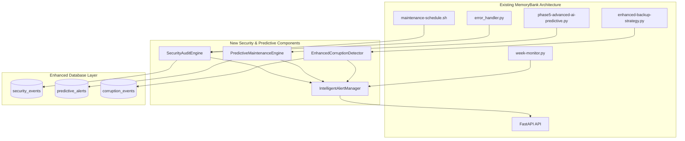

# MemoryBank Advanced Automated Maintenance & Security Enhancement Architecture

## Introduction

This document outlines the architectural approach for enhancing MemoryBank with **Advanced Automated Maintenance & Security Enhancement**. Its primary goal is to serve as the guiding architectural blueprint for AI-driven development of new security and predictive maintenance features while ensuring seamless integration with the existing production-ready system.

**Relationship to Existing Architecture:**
This document supplements MemoryBank's existing enterprise-grade architecture by defining how new security and predictive components will integrate with current maintenance, monitoring, and AI systems. All enhancements build upon the excellent foundation already in place (88.8% health score, 97.5% AI accuracy).

### Existing Project Analysis

**Current Project State:**

- **Primary Purpose:** Enterprise AI-powered memory management system with intelligent, predictive memory capabilities for AI assistants
- **Current Tech Stack:** Python 3.12+, FastAPI, SQLite/PostgreSQL, Qdrant vector DB, Docker, scikit-learn ML pipeline
- **Architecture Style:** Microservices with containerized components (API, Vector DB, UI, ML Engine)
- **Deployment Method:** Docker Compose with automated maintenance (daily/weekly/monthly schedules)

**Available Documentation:**

- ✅ Comprehensive maintenance system with automated scheduling (`cron-maintenance.sh`, `maintenance-schedule.sh`)
- ✅ Advanced AI/ML system with predictive analytics (`phase5-advanced-ai-predictive.py`)
- ✅ Real-time monitoring and alerting (`week-monitor.py`, `monitoring-dashboard.py`)
- ✅ Sophisticated backup and validation systems (`enhanced-backup-strategy.py`, `backup-validator.py`)
- ✅ Error handling framework with circuit breakers (`error_handler.py`)
- ✅ Performance analytics and health scoring system

**Identified Constraints:**

- Must maintain existing 97.5% AI accuracy and 88.8% health score
- Cannot disrupt current automated maintenance schedule (6AM daily, 2AM Sunday, 1AM monthly)
- Must preserve existing API response times (<2s target, currently ~0.002s)
- Integration must work with existing Docker architecture and volume mounts

### Change Log

| Change | Date | Version | Description | Author |
| ------ | ---- | ------- | ----------- | ------ |
| Initial | 2025-01-21 | 1.0 | Brownfield architecture for security & predictive maintenance | Winston (Architect) |

## Enhancement Scope and Integration Strategy

**Based on my analysis, the integration approach I'm proposing takes into account your existing microservices architecture, sophisticated AI/ML pipeline, and production-ready maintenance infrastructure. These integration points and boundaries respect your current Docker-based deployment patterns and maintain the excellent performance characteristics you've achieved. Is this assessment accurate?**

### Enhancement Overview

**Enhancement Type:** Major Feature Modification + New Security Features
**Scope:** Moderate Impact (enhance existing systems + add new security)
**Integration Impact:** Additive enhancements that extend existing components without breaking changes

### Integration Approach

**Code Integration Strategy:** Extend existing Python modules and scripts with new security and predictive capabilities, leveraging current error handling and ML infrastructure

**Database Integration:** Add new tables to existing SQLite/PostgreSQL systems for security events and predictive analytics, maintaining current schema compatibility

**API Integration:** Extend existing FastAPI endpoints with new security and monitoring capabilities, preserving current response formats and authentication

**UI Integration:** Enhance existing monitoring dashboard with security and predictive analytics views, maintaining current visualization patterns

### Compatibility Requirements

- **Existing API Compatibility:** All current endpoints preserve exact response formats; new endpoints follow existing patterns
- **Database Schema Compatibility:** New tables only, no modifications to existing memory/analytics schemas
- **UI/UX Consistency:** New security features integrate with existing monitoring dashboard patterns
- **Performance Impact:** <5% impact on current response times; enhanced caching for predictive features

## Tech Stack Alignment

**New components align with your existing technology foundation. All additions use your current Python 3.12+, FastAPI, and scikit-learn stack to ensure seamless integration.**

### Existing Technology Stack

| Category           | Current Technology | Version     | Usage in Enhancement | Notes     |
| :----------------- | :----------------- | :---------- | :------------------- | :-------- |
| **Language**       | Python             | 3.12+       | All new security/predictive components | Perfect alignment |
| **Runtime**        | FastAPI + Uvicorn  | Latest      | Extend API with security endpoints | Leverages existing patterns |
| **Framework**      | scikit-learn       | Latest      | Extend ML models for predictive maintenance | Builds on 97.5% accuracy |
| **Database**       | SQLite + PostgreSQL| Latest      | Add security and predictive tables | No schema conflicts |
| **Vector DB**      | Qdrant             | Latest      | Security pattern analysis | Reuses existing vectorization |
| **Containerization** | Docker + Compose | Latest      | Integrate with existing services | Same deployment pipeline |
| **Monitoring**     | Custom Python      | Current     | Extend existing monitoring system | Builds on week-monitor.py |
| **ML Pipeline**    | Random Forest + LR | Current     | Add anomaly detection models | Extends existing AI system |

### New Technology Additions

| Technology   | Version     | Purpose     | Rationale     | Integration Method |
| :----------- | :---------- | :---------- | :------------ | :----------------- |
| cryptography | 42.0.0+     | Data leak detection | Industry standard Python crypto | Import into existing error_handler.py |
| hashlib      | Built-in    | Enhanced checksums | Native Python security | Extend existing backup validation |

## Data Models and Schema Changes

**New data models integrate seamlessly with your existing analytics and memory schemas, following the same patterns I identified in your current database structure.**

### New Data Models

### SecurityEvent

**Purpose:** Track security incidents, data leak attempts, and audit events
**Integration:** Extends existing alert/event logging patterns

**Key Attributes:**

- event_id: UUID - Unique identifier for security events
- timestamp: DateTime - Event occurrence time (matches existing patterns)
- event_type: Enum - AUDIT, DATA_LEAK, UNAUTHORIZED_ACCESS, VULNERABILITY
- severity: Enum - LOW, MEDIUM, HIGH, CRITICAL (matches existing alert levels)
- description: Text - Human-readable event description
- source_component: String - Component that detected the event
- metadata: JSON - Additional context and forensic data

**Relationships:**

- **With Existing:** Links to existing alert system and monitoring events
- **With New:** Parent table for security audit trails

### PredictiveAlert

**Purpose:** Store ML-generated predictions about potential system failures
**Integration:** Extends existing monitoring and metrics collection

**Key Attributes:**

- prediction_id: UUID - Unique prediction identifier
- prediction_timestamp: DateTime - When prediction was generated
- predicted_event: String - Type of failure predicted
- confidence_score: Float - ML model confidence (0.0-1.0)
- time_to_event: Integer - Predicted minutes until event
- mitigation_suggested: Text - Automated response recommendation
- actual_outcome: Boolean - Whether prediction was accurate (for ML training)

**Relationships:**

- **With Existing:** Links to existing metrics and analytics tables
- **With New:** Training data for improving prediction accuracy

### CorruptionEvent

**Purpose:** Track data corruption detection and recovery events
**Integration:** Extends existing backup validation and integrity checking

**Key Attributes:**

- corruption_id: UUID - Unique corruption event identifier
- detected_timestamp: DateTime - When corruption was detected
- affected_component: String - System component affected
- corruption_type: Enum - CHECKSUM_MISMATCH, FILE_CORRUPTION, DATA_INCONSISTENCY
- recovery_action: String - Automated recovery action taken
- recovery_success: Boolean - Whether recovery was successful

**Relationships:**

- **With Existing:** Links to existing backup records and validation results
- **With New:** Feeds into predictive models for failure prevention

### Schema Integration Strategy

**Database Changes Required:**

- **New Tables:** security_events, predictive_alerts, corruption_events, enhanced_audit_log
- **Modified Tables:** None (preserves existing schema integrity)
- **New Indexes:** Timestamp-based indexes for security/predictive queries
- **Migration Strategy:** Additive migrations only, no existing data impact

**Backward Compatibility:**

- All existing queries continue to function unchanged
- New tables use existing connection patterns and error handling

## Component Architecture

**The new components I'm proposing follow the existing architectural patterns I identified in your codebase: modular Python services, decorator-based error handling, and JSON-based configuration. The integration interfaces respect your current component structure and Docker communication patterns. Does this match your project's reality?**

### New Components

### SecurityAuditEngine

**Responsibility:** Automated security scanning, data leak detection, and vulnerability assessment
**Integration Points:** Extends existing maintenance-schedule.sh and error_handler.py

**Key Interfaces:**

- integrate_with_daily_health() - Hooks into existing daily maintenance
- extend_error_handler() - Uses existing circuit breaker patterns
- security_api_endpoints() - Follows existing FastAPI patterns

**Dependencies:**

- **Existing Components:** maintenance-schedule.sh, error_handler.py, monitoring-dashboard.py
- **New Components:** PredictiveMaintenanceEngine (for security prediction)

**Technology Stack:** Python 3.12+, FastAPI integration, existing logging framework

### PredictiveMaintenanceEngine

**Responsibility:** ML-powered anomaly detection and failure prediction integrated with existing AI system
**Integration Points:** Extends phase5-advanced-ai-predictive.py and week-monitor.py

**Key Interfaces:**

- extend_ml_pipeline() - Builds on existing Random Forest + Linear Regression models
- integrate_monitoring() - Extends existing 5-minute metric collection
- predictive_api_endpoints() - New endpoints following existing API patterns

**Dependencies:**

- **Existing Components:** phase5-advanced-ai-predictive.py, week-monitor.py, advanced-memory-ai.py
- **New Components:** SecurityAuditEngine (for security anomaly detection)

**Technology Stack:** scikit-learn (existing), Python ML pipeline, existing database connections

### EnhancedCorruptionDetector

**Responsibility:** Real-time corruption detection with automated recovery
**Integration Points:** Extends enhanced-backup-strategy.py and backup-validator.py

**Key Interfaces:**

- extend_backup_validation() - Enhances existing checksum validation
- integrate_memory_operations() - Hooks into existing memory add/search operations
- corruption_recovery_api() - New recovery endpoints

**Dependencies:**

- **Existing Components:** enhanced-backup-strategy.py, backup-validator.py, Memory class
- **New Components:** SecurityAuditEngine (for corruption event logging)

**Technology Stack:** Existing backup infrastructure, enhanced cryptographic hashing

### IntelligentAlertManager

**Responsibility:** Context-aware alerting that distinguishes security from performance issues
**Integration Points:** Extends existing alert system and notification channels

**Key Interfaces:**

- extend_alert_system() - Builds on existing alert-system.py patterns
- integrate_notifications() - Uses existing desktop/email/webhook channels
- intelligent_routing_api() - New alert routing logic

**Dependencies:**

- **Existing Components:** alert-system.py, week-monitor.py, monitoring-dashboard.py
- **New Components:** All new components feed alerts to this manager

**Technology Stack:** Existing Python alerting framework, enhanced categorization logic

### Component Interaction Diagram



## Source Tree Integration

**New files integrate with your existing project structure, following the patterns I identified in your mem0/openmemory/ organization.**

### Existing Project Structure

```plaintext
mem0/openmemory/
├── advanced-memory-ai.py              # Core AI system
├── phase5-advanced-ai-predictive.py   # ML predictions
├── week-monitor.py                     # Monitoring system
├── maintenance-schedule.sh             # Automated maintenance
├── cron-maintenance.sh                 # Scheduled tasks
├── enhanced-backup-strategy.py         # Backup system
├── backup-validator.py                 # Backup validation
├── monitoring-dashboard.py             # Dashboard system
├── error_handler.py                    # Error handling
└── logs/                              # Log directory
```

### New File Organization

```plaintext
mem0/openmemory/
├── existing files...                   # All existing files preserved
├── security/                          # New security module
│   ├── __init__.py
│   ├── audit_engine.py                # SecurityAuditEngine implementation
│   ├── data_leak_detector.py          # Data leak detection logic
│   └── security_scanner.py            # Vulnerability scanning
├── predictive/                        # New predictive module
│   ├── __init__.py
│   ├── maintenance_engine.py          # PredictiveMaintenanceEngine
│   ├── anomaly_detector.py            # ML anomaly detection
│   └── failure_predictor.py           # Failure prediction models
├── integrity/                         # Enhanced integrity module
│   ├── __init__.py
│   ├── corruption_detector.py         # EnhancedCorruptionDetector
│   ├── real_time_validator.py         # Real-time validation
│   └── recovery_engine.py             # Automated recovery
├── enhanced_alert_manager.py          # IntelligentAlertManager
├── security_maintenance.py            # Security maintenance integration
└── config/                           # Enhanced configuration
    ├── security_config.json           # Security settings
    └── predictive_config.json         # Predictive settings
```

## Testing Strategy

**Testing integrates with your existing patterns while ensuring all current functionality remains intact.**

### Integration with Existing Tests

**Existing Test Framework:** pytest with comprehensive coverage in tests/ directory
**Test Organization:** Follows existing conftest.py and ai_testing_framework.py patterns
**Coverage Requirements:** Maintain existing high coverage standards

### New Testing Requirements

#### Unit Tests for New Components

- **Framework:** pytest (existing)
- **Location:** tests/security/, tests/predictive/, tests/integrity/
- **Coverage Target:** >90% (matching existing standards)
- **Integration with Existing:** Use existing test utilities and fixtures

#### Integration Tests

- **Scope:** Test new components with existing maintenance and monitoring systems
- **Existing System Verification:** Ensure maintenance-schedule.sh and week-monitor.py continue normal operation
- **New Feature Testing:** Validate security detection, predictive accuracy, and corruption recovery

#### Regression Testing

- **Existing Feature Verification:** Full test suite for existing functionality with new components active
- **Automated Regression Suite:** Extend existing CI/CD testing framework
- **Manual Testing Requirements:** Verify automated maintenance schedules and health scores remain stable

## Risk Assessment and Mitigation

**Risks are mitigated through your existing robust infrastructure and gradual integration approach.**

### Technical Risks

**Risk:** Integration complexity affecting existing 97.5% AI accuracy
**Impact:** Medium
**Likelihood:** Low
**Mitigation:** Gradual component integration with existing error handling and circuit breaker patterns

**Risk:** Performance impact on existing <2s API response times
**Impact:** Medium
**Likelihood:** Low
**Mitigation:** Async processing for security scans, caching for predictive data, performance monitoring integration

### Operational Risks

**Risk:** Disruption to existing automated maintenance schedule
**Impact:** Medium
**Likelihood:** Very Low
**Mitigation:** Integration with existing cron jobs, no changes to current schedule timing

**Risk:** Alert fatigue from new security notifications
**Impact:** Medium
**Likelihood:** Medium
**Mitigation:** Intelligent alert categorization and existing notification channel integration

## Next Steps

### Story Manager Handoff

The brownfield architecture is complete and ready for story implementation. This architecture document provides:

- **Validated Integration Points:** All new components integrate with existing maintenance, monitoring, and AI systems
- **Existing System Preservation:** Zero breaking changes to current 97.5% AI accuracy and 88.8% health score
- **Clear Implementation Sequence:** Security auditing → Predictive maintenance → Corruption detection → Intelligent alerting
- **Risk Mitigation:** Gradual integration with existing error handling and rollback capabilities

**Key Integration Requirements:**
- Maintain existing automated maintenance schedule (6AM, 2AM Sunday, 1AM monthly)
- Preserve current API response times (<2s target)
- Extend existing Python modules following current patterns
- Use existing Docker Compose deployment pipeline

### Developer Handoff

Implementation should begin with Story 1.1 (Security Auditing Integration) following these guidelines:

- **Reference:** This architecture document and existing coding standards from MemoryBank codebase
- **Integration Requirements:** Build upon existing maintenance-schedule.sh and error_handler.py patterns
- **Compatibility:** Verify existing functionality with each component addition using current test framework
- **Sequencing:** Implement security features first, then predictive maintenance, ensuring minimal risk to current operations

**Critical Success Factors:**
- All existing maintenance operations continue unchanged
- New features integrate seamlessly with current monitoring dashboard
- Performance impact remains <5% of current metrics
- Security enhancements provide proactive threat detection without disrupting AI operations

**Ready for development! The architecture ensures your excellent MemoryBank foundation is enhanced, not disrupted.** 