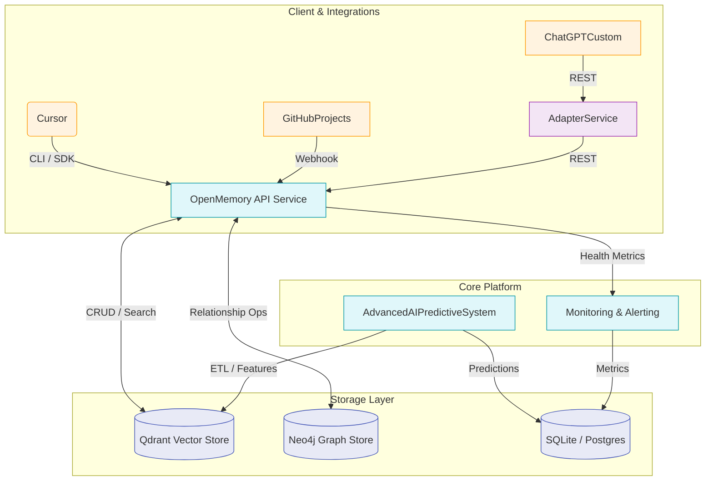

# 🏗️ Memory-C* System Architecture (Canonical)

**Status**: Authoritative reference – last updated automatically with major releases.

> All documentation SHOULD link here for architectural details instead of duplicating content. Summaries in other docs may remain but MUST defer to this file for accuracy.

---

## 📜 Executive Summary

Memory-C* (MemoryBank) is a modular, enterprise-grade AI memory platform. It combines a robust memory API, a predictive analytics engine, monitoring & observability services, and tight integrations with developer tooling. The platform follows a micro-services-plus-shared-database model, with clear boundaries between core memory storage, AI/ML processing, and auxiliary services.

---

## 🗺️ High-Level Component Map

---

## 🧩 Component Details

### 1. OpenMemory API Service (`mem0/openmemory/advanced-memory-ai.py`)
* **Role:** Authoritative CRUD/search interface for all memory operations.
* **Tech:** FastAPI, Pydantic, async httpx.
* **Endpoints:** `/memories`, `/search`, `/analytics`, `/health`.
* **Data Stores:** Qdrant (vector), Neo4j (graph).

### 2. Advanced AI Predictive Engine (`phase5-advanced-ai-predictive.py`)
* **Role:** Generates forecasts, anomaly scores, and insights on memory growth/usage.
* **Models:** RandomForestRegressor, LinearRegression (ensemble), IsolationForest.
* **Outputs:** JSON reports, PNG charts, health metrics → stored in `AnalyticsDB`.

### 3. Monitoring & Alerting (`monitoring-dashboard.py`, Prom-style exporter)
* **Role:** Aggregates metrics from API & ML engine, triggers alerts, exposes dashboards.
* **Integrations:** Slack/email channels via `notification_channels.json`.

### 4. External Adapter Services
* **GitHub Projects Integration** – syncs issues & PRs to memories.
* **ChatGPT Custom Adapter** – brown-field service translating GPT calls to memory ops.

### 5. Storage Layer
* **Vector Store:** Qdrant for semantic embeddings (approx. nearest-neighbour search).
* **Graph Store:** Neo4j for entity relationships and advanced traversals.
* **Analytics DB:** SQLite (local) or Postgres (prod) for reports & system metrics.

---

## 🔄 Data Flow Overview

1. **Memory Creation** – Client → OpenMemory API → (VectorDB + GraphDB)
2. **Context Retrieval** – Client → `ai-ctx*` CLI → OpenMemory → similarity search in VectorDB → response.
3. **Analytics Cycle** – Cron triggers ML engine → pulls data from VectorDB → computes forecasts/anomalies → stores results in AnalyticsDB → Monitoring ingests metrics.
4. **Alerting** – Monitoring evaluates thresholds → sends notifications if anomalies or health degradation detected.

---

## 🚦 Deployment Topology

* **Local Dev:** All services via `docker-compose.bmad.yml`.
* **Staging/Prod:** Kubernetes (k8s) with three deployments (API, ML, Monitoring) and managed DB services.
* **CI/CD:** GitHub Actions → Docker registry → k8s rollout; AI tests gate the pipeline.

---

## 🛡️ Security & Compliance

* OAuth2 bearer token for external adapters.
* Role-based access inside API (`admin`, `agent`, `readonly`).
* TLS everywhere; secrets managed via Infisical (`.infisical.json`).

---

## 🧪 Testing & Observability Hooks

* AI-enhanced testing framework runs unit + integration + ML regression tests.
* `/health`, `/metrics` endpoints expose Prometheus metrics.
* Self-correcting tests feed results back into memories (`ai-add-smart`).

---

## 🔗 Related Documents

* **Memory Commands Reference:** [`MEMORY_COMMANDS.md`](MEMORY_COMMANDS.md)
* **Integration Patterns:** [`../WORKFLOWS/INTEGRATION_PATTERNS.md`](../WORKFLOWS/INTEGRATION_PATTERNS.md)
* **Project Dashboard:** [`../PROJECT_CONTROL_CENTER.md`](../PROJECT_CONTROL_CENTER.md)

---

**Change Log**

| Date | Change | Author |
|------|--------|--------|
| 2025-07-01 | Initial canonical draft consolidating architecture | Documentation Bot |