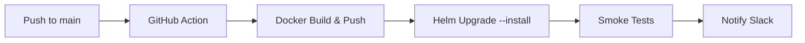

# 🚀 Memory-C* Deployment & Operations Guide (Canonical)

**Status**: Authoritative – consolidates legacy port-management, TLS migration, and architecture deployment notes.  
**Last Updated**: 2025-07-01

> Use this guide for all setup, deployment, and operational procedures. All other deployment docs are deprecated and should link here.

---

## 📜 Overview

Memory-C* supports three primary environments:

1. **Local Development** – Fast feedback loop with Docker Compose.  
2. **Staging** – Mirror of production running on Kubernetes.  
3. **Production** – Hardened k8s cluster behind Cloudflare with TLS 1.3, monitoring & alerting.

---

## 🖥️ Local Development

### Prerequisites
* Docker ≥ 24.0, Docker Compose plugin.  
* Python 3.12 (for CLI utilities).  
* `make`, `bash`.

### Quick Start
```bash
# Clone repo
git clone https://github.com/DrJLabs/MemoryBank.git && cd MemoryBank

# Start all core services + UI dashboard
docker compose -f docker-compose.bmad.yml up -d

# (Optional) override with local paths / ports
docker compose -f docker-compose.bmad.yml -f docker-compose.bmad.override.yml up -d

# Run unit tests
make test
```

Services started (defaults):
| Service | Container | Port |
|---------|-----------|------|
| OpenMemory API | `openmemory-api` | 8765 |
| Monitoring Dashboard | `monitoring-ui` | *Dynamic* (see Port Management) |
| Vector DB (Qdrant) | `qdrant` | 6333 |
| Graph DB (Neo4j) | `neo4j` | 7687 / 7474 |

---

## 🔌 Dynamic Port Management

Legacy port conflicts were resolved by the **Port Management System** (`archive/docs/port-management-summary.md`). The logic now lives in `mem0/openmemory/working-memory-dashboard.py` & `scripts/port-manager.py`.

* **Automatic Discovery** – Dashboard selects a free port if 8080 is busy.  
* **Registry File** – `/tmp/cursor-port-registry.json` tracks allocation.  
* **CLI Usage**
  ```bash
  python scripts/port-manager.py scan      # Refresh registry
  python scripts/port-manager.py status    # View occupied & free ports
  python scripts/port-manager.py get monitoring-ui
  ```

> 📝 Tip: When adding new local services, register them to prevent collisions.

---

## 🛡️ TLS & Security

Guidance consolidated from the **TLS 1.3 Migration Guide**:

| Layer | TLS Version | Notes |
|-------|-------------|-------|
| Cloudflare Edge | TLS 1.3 (0-RTT enabled) | Managed via Cloudflare Dashboard → SSL/TLS → Edge Certificates |
| Tunnel (Edge → Cluster) | TLS 1.3 | Cloudflare Tunnel using origin cert (`cloudflare-origin-ecc.pem`) |
| In-cluster (Traefik) | TLS 1.3 | `dynamic/tls-options.yml` with "modern" cipher suite |

### Traefik TLS Options (excerpt)
```yaml
# /etc/traefik/dynamic/tls-options.yml
modern:
  minVersion: VersionTLS13
  cipherSuites:
    - TLS_AES_128_GCM_SHA256
    - TLS_AES_256_GCM_SHA384
    - TLS_CHACHA20_POLY1305_SHA256
```

Apply & verify:
```bash
sudo systemctl restart traefik
openssl s_client -connect my.domain.com:443 -tls1_3 | grep Protocol
```

---

## ☸️ Staging & Production (Kubernetes)

1. **Cluster Setup** – Provision (EKS, GKE, or k3s) with at least 3 × 2 vCPU nodes.  
2. **Namespace** – `memorybank`.  
3. **Helm Charts** – located in `infrastructure/helm/` (one chart per component).  
4. **Secrets Management** – Infisical agent auto-injects secrets; see `.infisical.json`.

### Deployment Pipeline


CI job `deploy.yml` performs steps B-E automatically on `main`.

---

## 📈 Monitoring & Alerting

* **Dashboards** – Grafana at `/grafana` (proxied through Traefik).  
* **Alerts** – Prometheus Alertmanager routes to Slack/email as configured in `notification_channels.json`.  
* **Health Endpoints** – `/health`, `/metrics` exposed by API & ML services.

---

## 🔄 Zero-Downtime Upgrades

* Rolling updates via `kubectl rollout restart deploy/openmemory-api` (readiness probes ensure traffic only to healthy pods).  
* Database migrations use `alembic` jobs with `--atomic` flag.  
* Canary releases supported with Traefik `traefik.ingress.kubernetes.io/service-weights` annotations.

---

## 🆘 Troubleshooting Checklist

| Symptom | Likely Cause | Resolution |
|---------|--------------|-----------|
| Port 8080 already in use | Shadow process, collision | `python scripts/port-manager.py find 8080` → update env var |
| TLS handshake fails | Mis-configured cipher suite | Regenerate `tls-options.yml`, restart Traefik |
| API 5xx errors | DB connection lost | Check Qdrant/Neo4j pods, restart if necessary |
| Deployment stuck | Pending pods | Run `kubectl describe pod`, check resource quotas |

---

## 🔗 Related Documents

* Architecture – [`ARCHITECTURE.md`](ARCHITECTURE.md)  
* Port Manager Implementation – `archive/docs/port-management-summary.md`  
* TLS 1.3 Migration Details – `archive/docs/tls-migration-guide.md`  
* Monitoring Quick-start – `mem0/openmemory/BMAD_MONITORING_README.md`

---

**Deployment Status:** STABLE  
**Next Improvement:** Enable HTTP/3 (QUIC) on Cloudflare & Traefik.